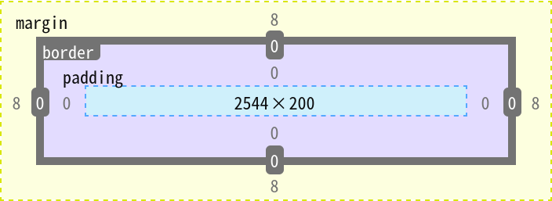

# 前端笔记

## html

### html术语

- 1.标签：一对`<>`  
    - 单标签：`<tagName />`
    - 双标签：`<tagName></tagName>`
        - 开始标签：`<tagName>`
        - 结束标签：`</tagName>`
- 2.属性：对标签特征进行设置的一种方式，一般在开始标签中定义
    - 当设置的属性值和属性名一样时，可以只写属性名
- 3.文本：双标签的开始标签和结束标签中间的文字，单标签是没有文本的
- 4.元素：可理解为一个定义好的标签就是一个元素（dom元素）

### html结构

- 1.文档声明，html5文档类型声明：`<!DOCTYPE html>`

- 2.根标签，`<html></html>`

- 3.头部标签，`<head></head>`
    - 告诉浏览器用指定字符集解码：`<meta charset="utf-8" />`
    - 浏览器显示html文件的页面的标题：`<title></title>`
- 4.主体标签，`<body></body>`

```html
<!DOCTYPE html>
<html lang="zh-CN">
    <head>
        <meta charset="UTF-8" />
        <title></title>
        <style></style>
    </head>
    <body>
        <div></div>
        <script></script>
    </body>
</html>
```

### html标签

#### 元信息/基本信息标签

用来表示该网页的基本信息

```html
<!-- 配置字符编码 -->
<meta charset="UTF-8" />
<!-- 针对IE浏览器的一个兼容性设置，让IE浏览器处于一个最优的渲染模式 -->
<meta http-equiv="X-UA-Compatible" content="IE=edge" />
<!-- 针对一些国产的“双核”浏览器的设置，让浏览器优先使用webkit内核去渲染网页 -->
<meta name="rander" content="webkit">
<!-- 针对移动端的一个配置 -->
<meta name="viewport" content="width=device-width, initial-scale=1.0" />
<!-- 配置网页的关键字，简单理解：搜索引擎会根据用户搜索的关键字，跟网页关键字进行比对，匹配的话该网页可能就会出现在搜索结果中 -->
<meta name="keywords" content="关键字1,关键字2,关键字..." />
<!-- 配置网页描述信息 -->
<meta name="description" content="填写80字以内的一段跟网页内容相关的一段话" />

<!-- 针对搜索引擎爬虫配置，content的值有很多，列举一些说明 -->
<!-- index：允许搜索爬虫索引此页面 -->
<!-- noindex：要求搜索爬虫不索引此页面 -->
<!-- follow：允许搜索爬虫跟随此页面上的链接 -->
<!-- nofollow：要求搜索爬虫不跟随此页面上的链接 -->
<!-- all：相当于index和follow -->
<!-- none：相当于noindex和nofollow -->
<!-- noarchive：要求搜索引擎不缓存页面内容，可以用替代名称nocache -->
<meta name="robots" content="nocache" />

<!-- 配置网页作者 -->
<meta name="author" content="handle" />

<!-- 配置网页生成工具 -->
<meta name="generator" content="如某个ide" />

<!-- 配置网页版权信息 -->
<meta name="copyright" content="2024-2026©版权所有" />

<!-- 配置网页自动刷新，网页打开后3秒跳到百度，如果不设置url就原地刷新 -->
<meta http-equiv="refresh" content="3;url=https://www.baidu.com" />
```

#### 标题

h1-h6共有6级，文本字体大小依次递减

```html
<h1>text</h1>
<h2>text</h2>
<h3>text</h3>
<h4>text</h4>
<h5>text</h5>
<h6>text</h6>
```

#### 段落

p标签里面不能嵌套h1-h6标签

```html
<p>text</p>
```

#### 换行

```html
<!-- 不带分割线 -->
<br />

<!-- 带分割线 -->
<hr />
```

#### 列表

- 有序列表：ol
- 无序列表: ul
- 列表项：li
- 列表可以嵌套列表

```html
<!-- 有序列表 -->
<ol>
    <li>text1</li>
    <li>text2</li>
    <li>text3</li>
</ol>

<!-- 无序列表 -->
<ul>
    <li>text1</li>
    <li>text2</li>
    <li>text3</li>
</ul>
```

#### 超链接

- href，定义要跳转的目标资源的地址，可以是
    - url
    - 相对路径
        - `./`，表示当前资源所在路径，可省略不写
        - `../`，表示当前资源上一层路径
        - 如果当前资源位置变了，路径要跟着变
    - 绝对路径
        - 以`/`开头，从固定位置（如<http://localhost:8080>)作为出发点去找目标资源
        - 如果当前资源位置变了，路径不用跟着变
- target，定义目标资源的打开方式
    - `_self`，在当前窗口打开目标资源
    - `_blank`，在新窗口打开目标资源

```html
<a href="https://www.baidu.com" target="_blank">百度一下</a>


<a href="#anyId">跳转到某个标签</a>
<p id="anyId">今天你很棒棒噢</p>

<!-- 当你点击 <a href="#"> 时 -->
<!-- 浏览器会尝试跳转到当前页面中 id="#" 的元素 -->
<!-- 因为通常页面里不会有这个元素，所以它不会发生实际的页面跳转或刷新 -->
<!-- 但会把滚动条瞬间拉回到页面的最顶部 -->
<a href="#"> 
```

#### 图片

- src，图片路径，可以是
    - url
    - 相对路径
    - 绝对路径
- title，鼠标悬停时提示的文字
- alt，图片加载失败时提示的文字

```html

```

#### 表格

- thead，表头，可不写
- tbody，表体，可不写
- tfoot，表尾（如总计），可不写
- tr，表格行
- td，单元格
    - rowspan，指定单元格占多少行，会把跟此单元格同一列的被占位置的单元格往下边挤，因此为了美观可以把被占位置的单元格删掉
    - colpan，指定单元格占多少列，会把跟此单元格同一行的被占位置的单元格往右边挤，因此为了美观可以把被占位置的单元格删掉
- th，自带加粗和居中效果的td
- 如果表头、表体、表尾都不写，浏览器会将tr都放到tbody里面

```html
<table>
    <tr>
        <th>columnName1</th>
        <th>columnName2</th>
        <th>columnName3</th>
    </tr>
    <tr>
        <td>columnValue1</td>
        <td>columnValue2</td>
        <td>columnValue3</td>
    </tr>
</table>
```

#### 表单

- 内部定义可以让用户输入信息的表单项标签

- 实现让用户在界面上输入各种信息并提交的一种标签，是向服务端发送数据的主要方式之一

- action，表单提交的地址，可以是
    - url
    - 相对路径
    - 绝对路径
- method，表单提交的方式
    - get
        - 表单数据会追加到url后面，以`?`作为参数开始的标识，`参数名=参数值`的形式，多个参数用`&`隔开
        - 数据会直接暴露在地址栏上
        - 地址栏长度有限制
        - 地址栏只能是字符，不能提交文件
        - 比post效率高
    - post
        - 表单数据默认不追加到url后面
        - 表单数据不会暴露在地址栏上，单独打包通过请求体发送
        - 提交数据量可以很大
        - 请求体可以是字符或字节数据，可以提交文件
        - 比get效率低

- target，跳转的新地址的打开方式，值：_self、_blank

```html
<form action="" method="" target="">
    <!-- 在此填充表单项 -->
</form>
```

##### 表单项

###### input

- input
    - name，提交时的参数名
    - value，提交时的参数值
    - type，表单项类型
        - text，普通文本框
            - readonly，只读，表单提交时会携带，`readonly=readonly`
            - disabled，不可用，表单提交时不携带，`disabled=disabled`
        - password，密码框
        - file，文件上传框
        - reset，重置按钮
        - submit，提交按钮
        - radio，单选框
            - 多个单选框定义同一个name属性值，来实现互斥效果
            - 还要通过value属性手动指定选中后的参数值是什么
            - 通过checked属性指定是否默认选中，写法：`checked="true"`或`checked="checked"`或`checked`
        - checkbox，复选框
            - 多个复选框定义同一个name属性值
            - 还要通过value属性手动指定选中后的参数值是什么
            - 通过checked属性指定是否默认选中，写法：`checked="true"`或`checked="checked"`或`checked`
        - hidden，隐藏域，不显示在页面上，提交时会携带

```html
<form action="" method="">
    <!-- 表单项 -->
    用户名：<input type="text" name="username" />
    <br />
    密码：<input type="password" name="password" />
    <br />
    头像：<input type="file" name="file" />
    <br />
    性别： 
    <input type="radio" name="gender" value="1" checked/> 男
    <input type="radio" name="gender" value="0"/> 女
    <br />
    爱好：
    <input type="checkbox" name="hobby" value="1" checked/> 唱
    <input type="checkbox" name="hobby" value="2"/> 跳
    <input type="checkbox" name="hobby" value="3"/> rap
    <br />
    <input type="hidden" name="id" value="123"/>
    <br />
    <input type="reset" value="清空" />
    <input type="submit" value="登录" />
</form>
```

###### 普通按钮

在表单中，普通按钮的type为button，如果不写type，默认为submit

以下是表单中的普通按钮的两种写法

```html
<input type="button" value="普通按钮">

<button type="button">普通按钮</button>
```

###### textarea

- textarea，文本域（多行文本框）
    - value就是textarea开始标签和结束标签中间的文本

```html
<form action="" method="">
    <!-- 表单项 -->
    个人简介：<textarea name="briefIntroduction" cols="30" rows="3">page load text</textarea>
</form>
```

###### select

- select，下拉框
    - option，选项
        - value，当不指定option的value属性值时，value就是option开始标签和结束标签中间的文本
        - selected，是否默认选中，写法：`selected="selected"`或`selected`

```html
<form action="" method="">
    <!-- 表单项 -->
    籍贯：
    <select name="birthplace">
        <option value="1">北京</option>
        <option value="2">上海</option>
        <option value="1000" selected>请选择</option>
    </select>
</form>
```

###### label

label可以用for属性，通过id关联其它表单控件

但是一般不与按钮进行关联，因为点label就相当于点了按钮，怪怪的

下面的例子的效果：点击label，username输入框也会获得焦点

```html
<label for="usernameInput">用户名：</label>
<input type="text" id="usernameInput" name="username" />
```

还有一种关联的写法

```html
<label for="usernameInput">
    用户名：
    <input type="text" name="username" />
</label>
```

###### 表单信息分类

```html
<fieldset>
    <legend>主要信息</legend>
    <!-- 以下写放在主要信息里面的表单项 -->
    用户名：<input type="text" name="username" />
    <br />
    密码：<input type="password" name="password" />
    <br />
</fieldset>
```

##### 禁用表单控件

给表单控件加上disabled属性即可禁用该表单控件

input、textarea、button、select、option都可以设置该属性

#### div

- 块元素，自己独占一行的元素
- css样式的宽，高等，往往都生效

#### span

- span，行内元素，不会自己独占一行的元素，img、a也是行内元素
- css样式的宽，高等，很多都不生效

#### iframe（框架标签）

框架标签可以嵌入很多东西，如：普通网页、广告网页、pdf、图片、gif、mp4、压缩包（打不开的文件会直接弹出下载窗口）

在src设置相应的url、相对地址等就行了

- 属性
    - src：资源，可以是网页，文件地址等
    - name：框架名称，可以与其它标签的target属性配合使用
    - frameborder：值可以是0（无边框）或1（有边框）

```html
<!-- 可以嵌入一个普通网页 -->
<iframe src="https://www.baidu.com" width="" height="" frameborder="0"></iframe>

<!-- iframe的name属性与超链接的target属性配合使用 -->
<a href="https://www.baidu.com" target="theTarget">百度一下</a>
<br/>
<iframe name="theTarget" width="" height="" frameborder="0"></iframe>

<!-- iframe的name属性与表单的target属性配合使用 -->
<form action="https://cn.bing.com/search" target="theTarget">
    <input type="text" name="q" />
    <button value="搜索" />
</form>
<br/>
<iframe name="theTarget" width="1280" height="720" frameborder="0"></iframe>
```

### 字符实体

html实体：在html中的一种特殊的形式的内容，表示某个符号

如：空格，当你在html里面写连续空格（按下多个空格键）的时候，浏览器只认第一个空格，余下的空格会当成对代码格式的调整

- 写法有两种：
    - 实体名称写法：`&实体名称;`
    - 实体编号写法：`&#实体编号;`

|符号|写法|
|:-|:-|
|空格|实体名称写法：`&nbsp;`，实体编号写法：`&#160`;|
|`<`|`&lt;`|
|`>`|`&gt;`|
|`&`|`&amp;`|
|`"`|`&quot;`|
|反引号`´`|`&acute;`|
|`¥`|`&yen;`|
|商标`™`|`&trade;`|
|注册商标`®`|`&reg;`|
|版权`©`|`&copy;`|
|乘法符号`×`|`&times;`|
|除法符号`÷`|`&divide;`|

### 全局属性（所有html标签都可以写的属性）

- 属性
    - id：给标签指定唯一标识
        - 同一个html中的id是不能重复的
        - 不能在`<html>`、`<head>`、`<meta>`、`<title>`、`<script>`、`<style>`中使用
    - class：给标签指定类选择器名称，通过在css定义的类选择器给标签设置样式
    - style：给标签设置样式
    - dir：内容在屏幕的位置/方向，值：ltr（从左往右）或rtl（从右往左）
        - 不能在`<html>`、`<head>`、`<meta>`、`<title>`、`<script>`、`<style>`中使用
    - title：给标签设置一个鼠标在其范围悬停时的文字提示，一般超链接和图片用得比较多
    - lang：给标签指定语言
        - 不能在`<head>`、`<meta>`、`<title>`、`<script>`、`<style>`中使用

### html元素间的关系

父元素：元素a直接包裹元素b，元素a就是元素b的父元素

子元素：元素a直接包裹元素b，元素b就是元素a的子元素

祖先元素：父元素的父元素...，一直往外找，都是祖先，父元素也是祖先，但是一般不这么称呼

后代元素：子元素的子元素...，一直往里找，都是后代，子元素也是后端元素，但是一般不这么称呼

兄弟元素：具有相同父元素的元素，互为兄弟元素

## html5

### html5标签

#### 布局标签

##### header

整个页面，或部分区域的头部

```html
<header>
    <h1></h1>
</header>
```

##### footer

整个页面，或部分区域的底部

```html
<footer>
    <nav></nav>
</footer>
```

##### nav

导航

```html
<nav>
    <a href="#">百度一下</a>
</nav>
```

##### article

文章、帖子、杂志、新闻、博客、评论等

article里面可以有多个section

article比section更强调独立性，一块内容如果比较独立，比较完整，应该使用article

```html
<article>
    <h2></h2>
    <section></section>
    <section></section>
</article>
```

##### section

页面中的某段文字，或文章中的某段文字（里面文字通常会包含标题）

section强调的是分段或分块，如果你想将一块内容分成几段的时候，就可以用它

```html
<section>
    <h3></h3>
</section>
```

##### aside

侧边栏

```html
<aside>
    <nav></nav>
</aside>
```

#### 状态标签

##### meter

定义已知范围内的标量测量，也被称为gauge（尺度）

如用来显示电量、磁盘用量等

- 属性
    - optimum，最优值，可选属性
    - 其它几个属性不解释了

```html
<meter max="100" min="0" low="10" high="20" optimum="90" value="60"></meter>
```

##### progress

显示某个任务完成的进度的指示器，一般用于表示进度条

```html
<progress max="100" value="80"></progress>
```

#### 列表标签

##### datalist

用于搜索框的关键字提示

```html
<form action="#">
    <input type="text" list="hotkey" />
    <button>search</button>
</form>
<datalist id="hotkey">
    <option value="java"></option>
    <option value="javascript"></option>
    <option value="python"></option>
</datalist>
```

##### details和summary

details用于展示问题和答案，或对专有名词进行解释

summary写在details的里面，用于指定问题或专有名词

```html
<details>
    <summary>如何在archlinux安装jdk</summary>
    <!-- 下面写补充summary内容的其它标签 -->
    <p>一，……</p>
    <p>二，……</p>
</details>
```

#### 文本标签

##### ruby和rt

用于文本注音

ruby包裹需要注音的文字

rt写注音，rt写在ruby的里面

```html
<div>
    <ruby>
        <span>栗</span>
        <rt>lì</rt>
    </ruby>
    <ruby>
        <span>粟</span>
        <rt>sù</rt>
    </ruby>
</div>
```

##### mark

用于文本标记，默认效果相当于给文字加了黄色背景

可以用来标记搜索结果中的关键字

```html
<p>Lorem ipsum <mark>dolor</mark> sit amet consectetur.</p>
```

#### 表单控件新增的属性

- 属性名
    - placeholder，提示文字，适用于文字输入类的表单控件
    - required，表示该输入项必填，适用于除按钮外的其它表单控件
        - 对于单选框，随便再任意一个选项上设置就行了
        - 对于复选框，设置了该属性的选项表示必须勾选
    - autofocus，自动获取焦点，适用于所有表单控件
    - autocomplete，根据历史输入自动补全，可以设置为on或off，适用于文字输入类的表单控件
        - 密码输入框、多行输入框不可用
        - 还需要在浏览器设置开启这个功能
    - pattern，填写正则表达式，适用于文本输入类表单控件
        - 多行输入不可用，且空的输入框不会验证，往往与required配合

```html
<input type="text"
        name="search"
        placeholder="请输入帐号"
        required
        autofocus
        autocomplete="on"
        pattern="\w{6}"
```

#### 表单控件input新增的type属性值

- 新增的type属性值
    - email，邮箱类型的输入框，表单提交时会验证格式，输入为空则不验证格式
    - url，url类型的输入框，表单提交时会验证格式，输入为空则不验证格式
    - number，数字类型的输入框，表单提交时会验证格式，输入为空则不验证格式
    - search，搜索类型的输入框，表单提交时不会验证格式
    - tel，电话类型的输入框，表单提交时不会验证格式，在移动端使用时，会唤起数字键盘
    - range，范围选择框，默认值为50，表单提交时不会验证格式
    - color，颜色选择框，默认值为黑色，表单提交时不会验证格式
    - date，日期选择框，默认值为空，表单提交时不会验证格式
    - month，月份选择框，默认值为空，表单提交时不会验证格式
    - week，周选择框，默认值为空，表单提交时不会验证格式
    - time，时间选择框，默认值为空，表单提交时不会验证格式
    - datetime-local，日期+时间选择框，默认值为空，表单提交时不会验证格式

```html
<form action="">
    <input type="email" name="email" />
    <input type="url" name="url" />
    <input type="number" name="number" min="20" max="100" step="1" />
    <input type="search" name="keyword" />
    <input type="tel" name="phoneNumber" />
    <input type="range" name="range" min="0" max="100" value="20" />
    <input type="color" name="color" />
    <input type="date" name="date" />
    <input type="month" name="month" />
    <input type="week" name="week" />
    <input type="time" name="time" />
    <input type="datetime-local" name="localDateTime" />
    <br>
    <button>submit</button>
</form>
```

#### form新增的属性

如果给form设置了novalidate，表单提交时不再进行校验

```html
<form action="" novalidate></form>
```

#### 视频标签

用来定义视频

- 属性
    - src，值为url地址，视频地址
    - width，像素值，视频播放器的宽度
    - height，像素值，视频播放器的高度
    - controls，无属性值，显示视频控件，如播放/暂停按钮
    - muted，无属性值，视频静音
    - autoplay，无属性值，视频自动播放
    - loop，无属性值，视频循环播放
    - poster，值为url地址，视频封面图片的地址
    - preload，视频预加载，如果使用autoplay，则忽略该属性，属性值有
        - none，不预加载视频
        - metadata，仅预先获取视频的元数据（如长度），现在也会预加载一段视频
        - auto，可以下载整个视频文件，即使用户不希望使用它（现在应该是浏览器自动协调了）

```html
<video src="/path/to/video" controls muted loop poster="/path/to/视频封面图片" preload="auto"></video>
```

#### 音频标签

用来定义音频

- 属性
    - src，值为url地址，音频地址
    - controls，无属性值，显示音频控件，如播放/暂停按钮
    - muted，无属性值，音频静音
    - autoplay，无属性值，音频自动播放
    - loop，无属性值，音频循环播放
    - preload，音频预加载，如果使用autoplay，则忽略该属性，属性值有
        - none，不预加载音频
        - metadata，仅预先获取音频的元数据（如长度），现在也会预加载一段音频
        - auto，可以下载整个音频文件，即使用户不希望使用它（现在应该是浏览器自动协调了）

```html
<audio src="/path/to/audio" controls muted loop preload="auto"></audio>
```

#### 元素新增的全局属性

- contenteditable，表示元素是否可被用户编辑，值有
    - true
    - false
- draggable，表示元素是否可被用户拖动，值有
    - true
    - false
- hidden，隐藏元素，效果和`display: none`一样
- spellcheck，规定是否对元素进行拼写和语法检查，值有
    - true，检查
    - false，不检查
- contextmenu，规定元素的上下文菜单，在用户鼠标右键点击时显示
- data-x，用于存储页面的私有定制数据

```html
<div data-mydata1="hello" data-mydata2="world"></div>
```

### html5兼容性处理

- 方法一，添加元信息，让浏览器处于最优渲染模式

```html
<!-- 针对IE浏览器的一个兼容性设置，让IE浏览器处于一个最优的渲染模式 -->
<!-- 设置IE总是使用最新的文档模式进行渲染 -->
<meta http-equiv="X-UA-Compatible" content="IE=edge" />
<!-- 针对一些国产的“双核”浏览器的设置，让浏览器优先使用webkit内核（Chromium）去渲染网页，如360等壳浏览器 -->
<meta name="rander" content="webkit">
```

- 方法二，使用html5shiv让低版本浏览器认识H5的语义化标签，这种方式对于H5的个别高级标签如video还是没法兼容的

```html
<!-- 下面三行的意思是判断如果ie浏览器的版本低于ie9，就导入html5shiv.js -->
<!--[if lt ie 9]>
<script src="/path/to/html5shiv.js"></script>
<![endif]-->
```

这种html的判断写法还有如下扩展知识

- lt，小于
- lte，小于等于
- gt，大于
- gte，大于等于
- !，逻辑非

```html
<!-- 仅IE8 -->
<!--[if IE 8]>
<![endif]-->

<!-- IE8以下 -->
<!--[if lt IE 8]>
<![endif]-->

<!-- 仅非IE8 -->
<!--[if !IE 8]>
<![endif]-->
```

## CSS

CSS全称：Cascading Style Sheets（层叠样式表）

CSS也是一种标记语言，用于给html结构设置样式，如文字大小、颜色、元素宽高等

html搭建结构，css添加样式，实现结构和样式的分类

### 样式表

#### 1.行内/内联样式表

```html
<div style="..."></div>
```

#### 2.内部样式表

```html
...
<head>
    <style type="text/css">
        ...
    </style>
</head>
...
```

#### 3.外部样式表

```html
<!-- rel是relation，说明引入的文档与当前文档的关系 -->
<link type="text/css" rel="stylesheet" href="xxx/xxx.css">
```

#### 样式表优先级

行内样式 > （内部样式 = 外部样式）

内部样式和外部样式优先级相同，后面的会覆盖前面的

同名的属性，优先级高的顶掉优先级低的，不同名的属性最终都会生效

同一个样式表中优先级也和顺序有关，后面的会覆盖前面的

### CSS 语法

- CSS 规则由两个主要部分构成：
    - 1.`选择器`：通常是需要改变样式的`HTML元素`
    - 2.`声明`（一条或多条）：
        - 声明用`{}`括起来，
        - 其中的每条声明由一个`属性`和一个`值`组成
        - 属性和值用`:`分开，每条声明以`;`结束
    - CSS注释以 `/*` 开始, 以 `*/` 结束

```css
p {
    color: red;
    text-align: center;
    /* css里面要严谨，带单位，不能只写数字 */
    font-size: 30px;
}
```

### 选择器

#### 通配选择器

通配选择器对清除样式很有帮助

```css
/* 选中所有的html元素 */
* {
    background-color: white;
}
```

#### 元素选择器

根据元素的class属性的值，来选中某些元素

为页面中某种元素统一设置样式

- 定义css

```css
/* 语法 */
标签名 {
    属性名: 属性值;
}

h1 {}
div, p {}
```

- 使用css：不用另外写语句，在该css生效的html文件中，对所有属于该类型的html元素都直接生效

```html
<h1></h1>
<div></div>
<p></p>
```

#### 类选择器

- 定义css

```css
/* 语法 */
.类名 {
    属性名: 属性值;
}

/* 选择html中所有class属性值为myClass1的元素 */
.myClass1 {}

/* 选择html中所有class属性值为myClass2的元素 */
.myClass2 {}
```

- 使用css

```html
<!-- class属性的值可以包含多个类名，用空格隔开 -->
<tagName class="myClass1 myClass2"></tagName>
```

#### id选择器

根据元素的id的属性值，来精准选中某个元素

- 定义css

```css
/* 语法 */
#元素id {
    属性名: 属性值;
}

#myId {}
```

- 使用css

```html
<tagName id="myId"></tagName>
```

#### 复合/组合选择器

##### 交集选择器

选中同时符合多个条件的元素

```css
/* 且 */
选择器1选择器2...选择器n {}

/* 虽然也可以这么写，但是很少用，因为id都可以唯一定位元素了，直接用id选择器定义样式就行了 */
标签名.类名#元素id {

}

/* 选中class属性的值包含类名1和类名2的元素，一般不会这么用 */
.类名1.类名2 {

}

/* html中使用css */
<tagName class="类名1 类名2"></tagName>
```

##### 并集选择器

选中多个选择器对应的元素，通常用于集体声明

```css
/* 或 */
选择器1,选择器2,...,选择器n {}

/* 美观的写法 */
选择器1,
选择器2,
...,
选择器n {}

/* 本质其实就相当于下面的写法，但是它们的样式内容是一样的 */
选择器1 {}
选择器2 {}
...     {}
选择器n {}
```

#### 后代选择器

选中指定（祖先）元素中，符合要求的后代元素

注意选中的是后代，不选中祖先

```css
/* 无论祖先还是后代选择器，都可以是上面学的任何一种选择器 */
祖先选择器 后代选择器1 后代选择器2 ... 后代选择器n {}

ul li {}

/* 祖先是类选择器，后代是交集选择器 */
.myClass1 div.myClass2 {}
```

#### 子代选择器

选中指定（父）元素中，符合要求的儿子元素

注意选中的是子代，不选中父元素

```css
/* 无论父还是子选择器，都可以是上面学的任何一种选择器 */
父选择器>子选择器1>子选择器2>...>子选择器n {}

/* 也可以在>的前后加空格 */
父选择器 > 子选择器1 > 子选择器2 > ... > 子选择器n {}

ul>li {}
```

#### 兄弟选择器

相邻兄弟选择器：选中指定元素后面，符合条件的`相邻`的兄弟元素

通用兄弟选择器：选中指定元素后面，符合条件的`所有`的兄弟元素

```html
<p>大哥</p>
<div></div>
<p>二弟</p>
<p>三弟</p>
```

```css
/* 相邻兄弟选择器 */
选择器1+选择器2 {}

/* 通用兄弟选择器 */
选择器1~选择器2 {}

/* 选中div后紧紧相邻的兄弟元素p，也就是二弟，往下找，不往上找 */
div+p {}

/* 选中div后所有的兄弟元素p，也就是二弟、三弟，往下找，不往上找 */
div~p {}
```

#### 属性选择器

选中具有某个属性或属性值符合某种要求的元素

注意一般不会用class属性作为属性选择器

```html
<div title="handle"></div>
```

```css
/* 写法一：选中具有title属性的元素，至于title属性的值是什么，是否相同都无所谓 */
[title] {}

/* 写法二：选中具有title属性，且title属性的值为handle的元素 */
[title="handle"] {}

/* 写法三：选中具有title属性，且title属性的值以字母h开头的元素 */
[title^="h"] {}

/* 写法四：选中具有title属性，且title属性的值以字母e结尾的元素 */
[title$="e"] {}

/* 写法五：选中具有title属性，且title属性的值包含字母a的元素 */
[title*="a"] {}
```

#### 伪类选择器

选中特殊状态的元素

类选择器：`.类名`
伪类选择器：`标签名:状态名`

```html
<a href="https://www.baidu.com">百度一下</a>
```

```css
/* 注意要严格按照link，visited，hover，active这个顺序来定义 */
/* link和visited是a元素独有的状态 */
/* hover和active是所有元素都有的状态 */
/* 选中的是没有访问过的a元素 */
a:link {}

/* 选中的是访问过的a元素 */
a:visited {}
```

##### 动态伪类

- link：超链接未被访问的状态
- visited：超链接访问过的状态
- hover：鼠标悬停在元素上的状态
- active：元素激活（按下鼠标不松开）的状态
- focus：获取焦点（点击，触摸或通过按下键盘的tab键等方式，选择元素时，就是获得焦点）的元素，表单类元素独有

```html
<a href="https://www.baidu.com">百度一下</a>
```

```css
/* 注意要严格按照link，visited，hover，active这个顺序来定义 */
/* link和visited是a元素独有的状态 */
/* hover和active是所有元素都有的状态 */
/* 选中的是没有访问过的a元素 */
a:link {}

/* 选中的是访问过的a元素 */
a:visited {}

/* 选中的是鼠标悬浮状态的a元素 */
a:hover {}

/* 选中的是激活状态的a元素 */
a:active {}

/* 选中的是获取焦点/输入状态的元素，focus是表单元素独有的状态 */
input:focus,select:focus {}
```

##### 结构伪类

- first-child
- last-child
- nth-child(n)：第n个儿子元素，n的值可以是
    - 0或不写，都不选中，一般不这么写
    - n，都选中，一般不这么写
    - 2n或even，表示选中偶数儿子
    - 2n+1或odd，表示选中奇数儿子
    - `-n+5`，表示选中前5个儿子
- nth-last-child(n)：倒数第n个儿子元素，很少用
- first-of-type
- last-of-type
- nth-of-type(n)：第n个某类型儿子元素
- nth-last-of-type(n)：倒数第n个某类型儿子元素，很少用
- only-child：选中独生儿子元素，要求其父元素只有一个儿子元素，很少用
- only-of-type：选中独生某类型儿子元素，要求其父元素只有一个该类型的儿子元素，很少用

###### 结构1

```html
<div>
    <p>选中</p>
    <p></p>
</div>
```

```css
/* 选中的是div的第一个儿子p元素（从div所有的儿子里面去找，即按照所有兄弟元素计算） */
div>p:first-child{}
```

###### 结构2

```html
<div>
    <!-- 都不会选中 -->
    <span></span>
    <p></p>
</div>
```

```css
/* 选中的是div的第一个儿子p元素（从div所有的儿子里面去找，即按照所有兄弟元素计算） */
div>p:first-child{}
```

###### 结构3

```html
<div>
    <p>>选中</p>
    <marquee>
        <p>选中</p>
    </marquee>
    <p></p>
</div>
```

```css
/* 选中的是div的后代p元素，且p的父元素是谁无所谓，但p必须是其父元素的第一个儿子（从div所有的儿子里面去找，即按照所有兄弟元素计算） */
div p:first-child{}
```

###### 结构4

```html
<body>
    <p>>选中</p>
    <div>
        <p>>选中</p>
        <marquee>
            <p>选中</p>
        </marquee>
        <p></p>
    </div>
</body>
```

```css
/* 选中的是p元素，且p的父元素是谁无所谓，但p必须是其父元素的第一个儿子（从所有的儿子里面去找，即按照所有兄弟元素计算） */
p:first-child{}
```

###### 结构5

```html
<div>
    <p></p>
    <p>选中</p>
    <p></p>
</div>
```

```css
/* 第2个儿子 */
div>p:nth-child(2) {}
```

###### 结构6

```html
<div>
    <span></span>
    <p>选中</p>
    <p></p>
</div>
```

```css
/* 选中的是div的第一个儿子p元素（从div所有的儿子p元素里面去找，即按照所有同类型元素计算） */
div>p:first-of-type {}
```

###### 结构7

```html
<html></html>
```

```css
/* 选中的是根元素（html） */
:root {}
```

###### 结构8

```html
<div></div>
```

```css
/* 选中的是没有内容（连一个空格都不要有）的div元素 */
div:empty {}
```

##### 否定伪类

`:not`：排除满足括号中条件的元素

```html
<div>
    <p></p>
    <p class="excludeClass"></p>
</div>
```

```css
/* 选中的是div的儿子p元素，但是排除类名为excludeClass的元素 */
div>p:not(.excludeClass) {}

/* not里面可以有其它写法 */
/* 选中的是div的儿子p元素，但是排除title属性值以hello开头的 */
div>p:not([title^="hello"]) {}

/* 选中的是div的儿子p元素，但是排除第一个儿子p元素 */
div>p:not(:first-child) {}
```

##### UI伪类

```html
<input type="checkbox" />
<input type="text" />
<input type="text" disabled />
```

```css
/* 选中的是勾选的复选框或单选按钮 */
input:checked {}


/* 选中的是可用的input元素（没有disabled属性），很少这么写 */
input:enabled {}
/* 相当于 */
input {}

/* 选中的是被禁用的input元素（有disabled属性） */
input:disabled {}
```

##### 目标伪类

```html
<a href="#top">回到顶部</a>
<div id="top">顶部</div>
```

```css
/* 点击超链接的时候，就会选中超链接的目标，即选中锚点指向的元素 */
div:target {}
```

##### 语言伪类

根据语言属性的值选择元素

```html
<div lang="en_US">handle</div>
```

```css
/* 选中div的lang的值是en_US的元素 */
div:lang(en_US) {}

/* 选中lang的值是zh_CN的元素 */
:lang(zh_CN) {}
```

#### 伪元素选择器

用来选中元素中的一些特殊位置

```html
<div>handle</div>
```

```css
/* 选中的是div开始标签和结束标签之间的文本的第一个字符，这里的例子即字符h */
div::first-letter {}

/* 选中的是div开始标签和结束标签之间的文本的第一行文字 */
div::first-line {}

/* 选中的是div开始标签和结束标签之间的文本中，被鼠标选择的文字 */
div::selection {}

/* 选中的是input元素中的提示文字，例如可以用来改背景色 */
input::placeholder {}

/* 选中的是p元素最开始的位置，例如可以用来添加前缀 */
p::before {
    content: "yourPrefix";
}

/* 选中的是p元素最后的位置，例如可以用来添加后缀 */
p::after {
    content: "yourSuffix";
}
```

#### 选择器优先级

当样式发生冲突时，优先级高的样式生效，优先级简单理解如下：

`!important` > [行内样式 >] id选择器 > 类选择器 > 元素选择器 > 通配选择器

```css
/* !important要慎用，行内样式要少写 */
div {
    color: green !important;
}
```

实际上是比较权重，权重大的生效，格式：(a, b, c)

a：id选择器的总个数

b：类、伪类、属性选择器的总个数

c：元素、伪元素选择器的总个数

- 比较规则：按照从左到右的顺序，依次比较大小，当前位胜出后，后面的位不再对比，如：(1, 0, 0) > (0, 1, 0)
    - 如果最终权重一样大，则后写的样式生效

- 行内样式权重大于所有选择器

- `!important`权重大于行内样式，权重最高

- 并集选择器的每一个部分都是分开算的（回看并集选择器的本质就知道了）

```html
<div class="myClass1">
    <p>
        <span class="myClass2"></span>
        <span></span>
    </p>
</div>
```

```css
/* (0, 2, 1) */
.myClass1 span.myClass2 {}

/* (0, 1, 3) */
div>p>span:nth-child(1) {}
```

### CSS三大特性

- 层叠性：如果发生了样式冲突，就会根据一定的规则，进行样式的层叠（覆盖）
    - 样式冲突：元素的同一个样式名（如color），被设置了不同的值，就发生了样式冲突

- 继承性：元素会自动拥有其父元素或其祖先元素上所设置的某些样式
    - 规则：优先继承离得近的
    - 常见的可继承属性：text-?, font-?, line-?, color ...，参照mdn网站，查询属性是否可被继承

- 优先级：`!important` > [行内样式 >] id选择器 > 类选择器 > 元素选择器 > 通配选择器 > 继承的样式

### 像素和颜色

- 定义长度，单位虽然支持用cm，好像mm也支持，但是一般用像素单位px

- 定义颜色
    - 可以用颜色名如：green，但是一般不这么用，因为支持的颜色名有限
    - 用rgb
        - 全部用数值：rgb(255, 0, 0)
        - 也可以全部用百分比：rgb(%100, 0%, 0%)
        - 三种颜色值相同，呈现的是灰色，值越大，灰色越浅
    - 用rgba，只是跟rgb相比多了透明度这个维度，透明度的值为：0（完全透明）~ 1（不透明），透明度也可以写成百分数，注意rgb必须保持一致（全部是数值或全部是百分比）
        - rgb(255, 0, 0, 0.5)，0.5也可以写成.5
        - rgb(255, 0, 0, 50%)
    - 用hex：就是红绿蓝的颜色值分别用两位的16进制表示，不区分大小写
        - 如：`#ff0000`
        - 如果颜色值全都是两两相同，可以用简写，如：`#f00`
    - 用hexa：只是跟hex相比多了透明度这个维度，透明度的值为：`00`（完全透明）~ `ff`（不透明）
        - 如：`#ff000088`
        - 如果颜色值全都是两两相同，可以用简写，如：`#f008`
            - 如果颜色值用了简写，透明度也必须用简写
        - ie浏览器不支持hexa颜色，但支持hex颜色
    - 用hsl：`hsl(色相, 饱和度, 亮度)`
        - 色相就是颜色，但是是用角度表示的：0deg-360deg，后缀deg可以省略，可以查hsl的色相图了解度数对应的颜色
        - 饱和度：0%-100%，全灰就是0%，彩色（无灰度）就是100%
        - 亮度：0%-100%，0%（黑）和100%（白）是两个极端，一般不用这两个值
        - 如：hsl(0deg, 100%, 50%)，就相当于rgb(255, 0, 0)
    - 用hsla：只是跟hsl相比多了透明度这个维度，透明度的值为：0（完全透明）~ 1（不透明），透明度也可以写成百分数

### 常用字体属性

#### 字体大小

chrome浏览器默认支持的最小字体大小为12px，默认字体大小为16px，设置为0px时字体会自动消失

不同浏览器默认的字体大小可能不一样，最好设置一个明确的字体大小

通常给body设置font-size属性，这样body中的其它元素就都可以继承了

```css
body {
    /* 调整字体大小为16像素 */
    font-size: 16px;
}
```

由于字体设计原因，文字最终呈现的大小，并不一定与font-size的值一直，可能大，也可能小

文字相对字体设计框，并不是垂直居中的，通常都靠下一些

#### 字体族

声明字体族的时候应该统一都用sans-serif或者都用serif字体

为了规范，字体名称应该都用英文+双引号的写法

因为英文字体名兼容性更好，英文字体名按需自行查询

如果字体名包含空格，必须用双引号包裹

可以设置多个字体，浏览器会按照从左到右的顺序逐个查找，找到就用

没有找到就继续找后面的，最后用sans-serif或者都用serif兜底

windows中，默认字体是微软雅黑

```css
body {
    /* 最后的sans-serif是范指，告诉浏览器当前面的字体都不可用的时候，就查用户系统可用的sans-serif字体 */
    font-family: "优先字体1","其次字体2","再而字体3", ..., "字体n", sans-serif；
}
```

#### 字体风格

- font-style有三个值
    - normal：默认值
    - italic：斜体，优先找该字体自带的倾斜字体，没有找到时，强行倾斜，推荐
    - oblique：斜体，强行倾斜

```css
body {
    font-style: italic;
}
```

#### 字体粗细

- font-weight有四个值，依次变粗
    - lighter，细
    - normal，正常
    - bold，粗
    - bolder，更粗，绝大多数字体没有设置这个字体，用的不多
    - 还可以是数值：100-1000，不带单位，但是大多数字体没有设计那么多梯度的粗体，开发的时候用数字的情况还挺多的
        - 100-300等同于lighter
        - 400-500等同于normal
        - 600及以上等同于bold

```css
body {
    font-weight: lighter;
}
```

#### 字体复合属性

```css
body {
    /* 字体族和字体大小是必须的，倒数第一个值必须是字体族，倒数第二个值必须是字体大小，其它值顺序随意 */
    /* 不同的值用空格隔开 */
    /* 开发更推荐这种复合属性写法 */
    font: 20px "微软雅黑", "宋体";
}
```

### 常用文本属性

#### 文本颜色

```css
div {
    color: red;
}
```

#### 文本间距

文本间距的值，0px是默认值，还可以是负值，这样文本就被挤压到一起了

```css
div {
    /* 文本中的字母之间的间距，可以控制汉字 */
    letter-spacing: 20px;
    /* 文本中的英文单词之间的间距，不能控制汉字 */
    /* 如果每个汉字之间添加了空格是可以控制的，但是中文文本一般不会这么写 */
    word-spacing: 20px;
}
```

#### 文本修饰

上划线、下划线、删除线等都是文本修饰

```css
div {
    /* overline：上划线 */
    /* underline：下划线 */
    /* line-through：删除线 */
    /* none：无装饰线，默认，给a标签设置这个值就可以去掉默认的下划线了 */
    text-decoration: line-through;

    /* 还可以设置线的样式：dotted，虚线；wavy，波浪线 */
    text-decoration: line-through wavy;

    /* 还可以设置线的颜色，这几个值的顺序都是随意的 */
    text-decoration: line-through wavy green;
}
```

#### 文本缩进

```css
div {
    font-size: 20px;
    /* 普通写法，设置为font-size的整数倍n来定义缩进为n个字符 */
    text-indent: 40px;
    /* 进阶写法，缩进几个字就写几em */
    text-indent: 2em;
}
```

#### 行高

由于字体设计原因，文字在一行中，并不是绝对垂直居中，字体有可能是超出了字体框的范围的

如果行高设置成跟字体一样大小，可能就会上一行的字体底部跟下一行字体的顶部挤在一起

- line-height的值可以是
    - normal，默认，浏览器根据字体大小自适应行高
    - 像素值
    - 数值，参考自身font-size的倍数，这种写法用的多，1.5~2.0是比较常用的值，如1.5，最终行高为1.5 * font-size的值，
    - 百分比，参考自身font-size的百分比，如数值写法1.5的百分比写法就是150%，最终行高为1.5 * font-size的值

```css
div {
    font-size: 20px;
    /*  */
    line-height: 30px;
}
```

如果行高过小，多行的文字会重叠

行高最小值是0，不能是负数，设置为负数会被浏览器标识无效，并显示为normal的行高

行高是可以继承的，因此用数值写法更方便继承

- line-height和元素的height属性的关系
    - 设置了height，高度就是height的值
    - 没有设置height，高度就是line-height * 行数

- 行高的应用场景
    - 调整多行文字的间距
    - 单行文字的垂直居中（非绝对垂直居中，观感上垂直居中）

```css
div {
    height: 30px;
    font-size: 20px;
    /* line-height设置成和height一样就可以实现单行文本垂直居中了 */
    line-height: 30px;
}
```

#### 文本对齐

- 水平对齐，属性名`text-align`，值有
    - left，默认
    - center
    - right

```css
dev {
    text-align: left;
}
```

- 垂直对齐
    - 顶部：默认
    - 居中
        - 单行文本：line-height设置成和height一样
        - 多行文本用定位解决
    - 底部
        - 单行文本：临时解决办法，设置line-height=height * 2 - font-size - x，x是根据字体族动态决定的一个微调值，更好的底部对齐用定位解决

```css
div {
    height: 30px;
    font-size: 20px;
    /* line-height设置成和height一样就可以实现单行文本垂直居中了 */
    line-height: 30px;
}
```

#### vertical-align

用于指定同一行元素之间，或表格单元格内文字的垂直对齐方式

- 常用值
    - baseline，默认，使元素的基线与父元素的基线对齐
    - top，使元素的顶部与其所在行的顶部对齐
    - middle，使元素的中部与父元素的基线加上父元素字母x的一半对齐（父元素字母x的中心点所在的那条线）
    - bottom，使元素的底部与其所在行的底部对齐

注意vertical-align不能控制块元素

```html
<div>
    fatherx<span>xson</span
</div>
```

```css
div {
    height: 300px;
    font-size: 100px;
    background-color: skyblue;
}

span {
    font-size: 40px;
    vertical-align: middle;
    background-color: orange;
}
```

### 列表相关属性

这些属性都可以用在ul、ol、li元素上

```html
<ul>
    <li></li>
    <li></li>
</ul>
```

```css
ul {
    /* 列表符号，即列表项前面的符号 */
    /* 值有：none，square，lower-roman，upper-roman，decimal，lower-alpha，upper-alpha，disc */
    list-style-type: none;

    /* 列表符号的位置，给li标签设置背景色才能看出效果：inside、outside */
    list-style-position: inside;

    /* 自定义列表符号 */
    list-style-image: url("/path/to/image");

    /* 复合属性，数量、顺序随意 */
    /* 这里自定义列表符号会覆盖decimal */
    list-style: decimal inside url("/path/to/image");
}
li {
    background-color: orange;
}
```

### 边框相关属性

这几个边框属性，除了table，th和td外，其它元素也可以用

- border-style，边框风格，值有
    - none，默认
    - solid，实线
    - dashed，虚线
    - dotted，点线
    - double，双实线

```css
table {
    /* 只要指定了border-style就能显示边框，border-width和border-color都有默认值 */
    border-width: 2px;
    border-color: red;
    border-style: solid;

    /* 复合属性 */
    border: 2px red solid;
}

th,td {
    border: 2px green solid;
}
```

### 表格独有属性

```css
table {
    /* 复合属性 */
    border: 2px red solid;

    width: 500px;

    /* 表格列宽：auto、fixed */
    table-layout: fixed;
    /* 单元格间距，border-collapse为separate时才有效果 */
    border-spacing: 5px;
    /* 合并相邻单元格的边框：collapse、separate */
    border-collapse: collapse;
    /* 隐藏没有内容的单元格：show、hide，设置为hide时， border-collapse为separate才有效果 */
    empty-cells: hide;
    /* 表格标题的位置：top、bottom */
    caption-side: top;
}
```

### 背景相关属性

- background-position的值有
    - 水平方向：left、center、right
    - 垂直方向：top、center、bottom
    - 如果只写一个方向的值，另一个方向的值默认为center
    - 还可以指定坐标位置，分别表示x坐标和y坐标的值，如：100px 200px
    - 只写一个坐标值，会被当作x坐标，y坐标默认为center

```css
div {
    /* 背景颜色，默认transparent */
    background-color: blue;
    /* 背景图片 */
    background-image: url("/path/to/image");
    /* 背景图片的重复方式：repeat、no-repeat、repeat-x、repeat-y */
    background-repeat: repeat;
    /* 背景图片位置 */
    background-position: left top;
    /* 复合属性：属性值随意，顺序随意 */
    background: blue url("/path/to/image") no-repeat left top;
}
```

### 鼠标相关属性

- cursor的值有
    - pointer，小手
    - move，移动图标
    - text，文字选择器
    - crosshair，十字架
    - wait，等待
    - help，帮助
    - 还有其它值，就不一一列举了

```css
div {
    cursor: pointer;

    /* 还可以是图片，如果不显示，用ico格式试试 */
    /* 末尾还要记得加上图片所代表的cursor的值，如pointer */
    cursor: url("/path/to/image"), pointer;
}
```

### 常用长度单位

- px，像素
- em，相对于当前元素或其祖先元素的font-size的倍数
    - 如果当前元素没有设置font-size，就从祖先元素找，如果都没有设置，就用浏览器默认的font-size
    - 如果font-size也设置为em，就从祖先元素找，如果都没有设置，就用浏览器默认的font-size
- rem，r表示root，即html元素，相对于根元素的font-size的倍数
- %，相对当前元素的父元素的百分比
- 不常用单位：cm、mm

注意css中设置长度必须加单位，否则样式无效

```css
div {
    /* 10 x 20px = 200px */
    width: 10em;
    height: 10em;
    font-size: 20px;
}
```

### 元素的显示模式

- 块元素（block），又称块级元素
    - 在页面中独占一行，不会与任何元素共用一行，是从上到下排列的
    - 默认宽度：撑满父元素
    - 默认高度：由内容撑开
    - 可以通过css设置宽高
- 举例：
    - 主体结构元素：html、body
    - 排版元素：h1~h6、hr、p、pre、div
    - 列表元素：ul、ol、li、dl、dt、dd
    - 表格相关元素：table、thead、tbody、tfoot、tr、caption
    - 表单元素：form、option

```html
<div></div>
```

```css
div {
    width: 200px;
    height: 200px;
}
```

- 行内元素（inline），又称内联元素
    - 在页面中不独占一行，一行中不能容纳下的行内元素，会在下一行继续从左到右排列
    - 默认宽度：由内容撑开
    - 默认高度：由内容撑开
    - 无法通过css设置宽高
- 举例：
    - 文本元素：br、em、strong、sup、sub、del、ins
    - a、label

```html
<span></span>
```

- 行内块元素（inline-block），又称内联块元素
    - 在页面中不独占一行，一行中不能容纳下的行内元素，会在下一行继续从左到右排列
    - 默认宽度：由内容撑开
    - 默认高度：由内容撑开
    - 可以通过css设置宽高
- 举例：
    - 图片：img
    - 单元格：th、td
    - 表单控件：input、textarea、select、button
    - 框架元素：iframe

```html

```

```css
img {
    width: 200px;
}
```

元素早期只分为：行内元素、块级元素，区分条件也只有一种：是否独占一行

如果按照这种分类方式，行内块元素应该算作行内元素

#### 修改元素的显示模式

```css
div {
    /* 元素作为块级元素显示 */
    display: block;
    display: inline;
    display: inline-block;
    /* 不显示该元素 */
    display: none;
}
```

### 盒子模型

#### 盒子模型的组成部分



从外到里：外边距（margin）、边框（border）、内边距（padding）、内容区（content）

css会把所有的html元素看成是这么一个盒子模型

盒子的大小 = content + 左右padding + 左右border

外边距不会影响盒子的大小（当不设置元素的width时），但会影响盒子的位置

```css
div {
    /* 内容区的宽高 */
    width: 200px;
    height: 200px;
    /* 内边距，设置的背景色会填充内边距区域 */
    padding: 8px;
    /* 边框，设置的背景色会填充内边框区域 */
    border: 2px solid red;
    /* 外边距 */
    margin: 5px;
}
```

#### 盒子的内容区

min-width、max-width一般不与width一起使用

min-height、max-height一般不与height一起使用

```css
div {
    width: 800px;

    min-width: 600px;
    max-width: 1000px;
    
    height: 200px;

    min-height: 100px;
    max-height: 400px;
}
```

#### 元素的默认宽度

就是不设置width属性时，元素所呈现出来的宽度

元素总的默认宽度= 父元素的content - 元素自身左右margin

元素内容区的默认宽度 = 父元素的content - 元素自身左右margin - 自身左右border - 自身左右padding

#### 盒子的内边距

内边距不能是负数，负数无效

可以设置行内元素的左右内边距，但是上下内边距不能完美设置

块级元素、行内块元素，四个方向的内边距都可以完美设置

```css
div {
    /* 分开写 */
    padding-top: 8px;
    padding-right: 8px;
    padding-bottom: 8px;
    padding-left: 8px;

    /* 复合属性，写一个值，表示：四个方向的内边距都一样 */
    padding: 8px;

    /* 复合属性，写两个值，分别表示：上下、左右的内边距 */
    padding: 10px 20px;

    /* 复合属性，写三个值，分别表示：上、左右、下的内边距（上中下） */
    padding: 10px 20px 30px;

    /* 复合属性，写四个值，分别表示：上、右、下、左内边距（顺时针） */
    padding: 10px 20px 30px 40px;
}
```

#### 盒子的边框

```css
div {
    border-left-width: 2px;
    border-right-width: 2px;
    border-top-width: 2px;
    border-bottom-width: 2px;

    border-left-color: red;
    border-right-color: green;
    border-top-color: blue;
    border-bottom-color: orange;

    border-left-style: solid;
    border-right-style: dashed;
    border-top-style: double;
    border-bottom-style: dotted;

    /* 只要指定了border-style就能显示边框，border-width和border-color都有默认值 */
    /* 复合属性 */
    border-width: 2px;
    border-color: red;
    border-style: solid;

    /* 复合属性 */
    border-left: 2px red solid;
    border-right: 2px red solid;
    border-top: 2px red solid;
    border-bottom: 2px red solid;

    /* 复合属性 */
    border: 2px red solid;
}
```

#### 盒子的外边距

子元素的margin是参考父元素的content计算的

margin-left、margin-top会影响元素自身的位置；margin-right、margin-bottom会影响兄弟元素的位置

对于行内元素，margin-left、margin-right可以完美设置，margin-top、margin-bottom设置后无效

margin的值可以是负值

```css
div {
    margin-left: 10px;
    margin-right: 10px;
    margin-top: 10px;
    margin-bottom: 10px;

    /* 复合属性，写一个值，表示：四个方向的外边距都一样 */
    margin: 8px;

    /* 复合属性，写两个值，分别表示：上下、左右的外边距 */
    margin: 10px 20px;

    /* 复合属性，写三个值，分别表示：上、左右、下的外边距（上中下） */
    margin: 10px 20px 30px;

    /* 复合属性，写四个值，分别表示：上、右、下、左外边距（顺时针） */
    margin: 10px 20px 30px 40px;
}
```

margin的值可以是auto，给一个块级元素左右margin设置auto可以实现该元素在其父元素内水平居中

```css
div {
    /* 这两个设置可以实现水平居中 */
    /* 跟左边有多远离多远 */
    margin-left: auto;
    /* 跟右边有多远离多远 */
    margin-right: auto;

    /* 也可以这么写，上下随意，左右auto */
    margin: 10px auto;
}
```

#### margin塌陷问题

margin塌陷：第一个子元素的上margin会作用在父元素上（相当于父元素设置了上margin），最后一个子元素的下margin会作用在父元素上，（相当于父元素设置了下margin）

- 解决塌陷
    - 方法一：给父元素设置不为0的padding
    - 方法二：给父元素设置宽度不为0的border
    - 方法三：给父元素设置css样式：`overflow:hidden`

#### margin合并问题

margin合并：上面兄弟元素的下margin和下面兄弟元素的上margin会合并，取二者的最大值，而不是相加

- 如何解决margin合并问题：
    - 无需解决，布局的时候上下兄弟元素，只给一个设置就可以了
    - 如只给上面的兄弟设置下margin，或只给下面的兄弟元素设置上margin

### 处理内容溢出

- overflow、overflow-x、overflow-y属性值
    - visible，显示溢出内容
    - hidden，隐藏溢出内容
    - scroll，无论内容是否溢出都会显示滚动条
    - auto，根据内容是否溢出自动显示滚动条

```css
div {
    /* 主要用这个 */
    overflow: auto;

    /* 不能一个显示一个隐藏 */
    overflow-x: auto;
    overflow-y: auto;
}
```

### 隐藏元素的两种方式

```css
div {
    /* 方式一，彻底隐藏，不但看不见，也不占原来的位置，没有大小了 */
    display: none;

    /* 方式二，属性：show、hidden，元素设置为hidden在页面上看不到了，还会占有原来的位置（元素大小依然保持） */
    visibility: hidden;
}
```

### 样式的继承

有些样式会继承，元素本身如果设置了某个样式，就使用自身设置的样式

如果元素本身没有设置某个样式，会从父元素开始一级一级继承（优先继承离得近的祖先元素）

会继承的属性：字体属性、文本属性（除了vertical-align）、文字颜色等

不会继承的属性：边框、背景、内边距、外边距、宽高、溢出方式等

规律：能继承的属性，都是不影响布局的，也就是跟盒子模型没关系的属性

### 元素的默认样式

- 元素一般都有默认的样式，如
    - a：下划线、字体颜色、鼠标小手
    - h1~h6: 文字加粗、文字大小、上下外边距
    - p：上下外边距
    - ul、ol：左内边距
    - body：8px的外边距
优先级：元素的默认样式 > 继承的样式

如果要重置元素的默认样式，选择器一定要直接选中该元素

### 布局小技巧

行内元素、行内块元素，可以被父元素当作文本处理

即可以像处理文本对齐一样处理行内元素、行内块元素在父元素中的对齐

例如：text-align、line-height、text-indent等

- 如何让子元素在父元素中水平居中
    - 若子元素为块元素，给子元素加上`margin: 0 auto`
    - 若子元素为行内元素或行内块元素，给父元素加上`text-align: center`

- 如何让子元素在父元素中垂直居中
    - 若子元素为块元素，给子元素加上margin-top，值为：（父元素content高 - 子元素盒子高） / 2
    - 若子元素为行内元素或行内块元素
        - 让父元素的line-height和height一样
        - 每个子元素都加上`vertical-align:middle`
        - 若想绝对垂直居中，父元素的字体大小设置为0，然后再给子元素指定想要的字体大小覆盖继承的父元素的字体大小

#### 布局小技巧1

```html
<div class="outer">
    <div class="inner">inner</div>
</div>
```

```css
.outer {
    width: 400px;
    height: 400px;
    background-color: gray;
    /* 解决塌陷问题 */
    overflow: hidden;
}

.inner {
    width: 200px;
    height: 100px;
    background-color: orange;
    /* 元素水平居中 */
    margin: 0 auto;
    /* 注意margin-top会有塌陷问题 */
    /* 元素垂直居中，，计算公式：(父元素content的高度-(自身content+上下padding+上下border))/2 */
    margin-top: 150px;

    /* 文本水平居中 */
    text-align: center;
    /* 文本垂直居中，单行文本设置line-height等于height就行了 */
    line-height: 100px;
}
```

#### 布局小技巧2

```html
<div class="outer">
    <span class="inner">inner</span>
</div>
```

```css
.outer {
    width: 400px;
    height: 400px;
    background-color: gray;

    /* 行内元素、行内块元素可以当成文本来处理，也就是可以使用文本的布局方式 */
    text-align: center;
    line-height: 400px;
}

.inner {
    background-color: orange;
    font-size: 20px;
}
```

#### 布局小技巧3

```html
<div class="outer">
    <span>inner</span>
    
</div>
```

```css
.outer {
    width: 400px;
    height: 400px;
    background-color: gray;

    text-align: center;
    /* 由于字体设计原因不是绝对居中，将字体大小设置为0就行了 */
    line-height: 400px;
    font-size: 0px;
}

img {
    vertical-align: middle;
}

span {
    font-size: 40px;
    vertical-align: middle;   
    background-color: orange; 
}
```

### 元素之间的空白问题

产生原因：行内元素、行内块元素彼此之间的换行会被浏览器解析为一个空白字符

- 解决办法有两种
    - 去掉换行和空格（不推荐）
    - 给父元素设置`font-size: 0`，再给需要显示文字的子元素单独设置字体大小

```html
<div>
    <span>1</span>
    <span>2</span>
    <span>3</span>
    
    
    
</div>
```

```css
div {
    font-size: 0px;
}

span {
    font-size: 20px;
}
```

### 行内块元素的幽灵空白问题

问题原因：行内块元素与文本的基线（x底部）对齐，而文本的基线与文本最底端之间是有一定间距的

- 解决办法
    - 一，给行内块设置vertical，值不为baseline都可，如top、middle、bottom
    - 二，若父元素中只有一张图片，设置图片为块元素`display:block`
    - 三，给父元素设置字体大小为0，如果该行内块内部还有文本，则另单独设置字体大小

```html
<div>
    
</div>
```

```css
div {
    width: 600px;
    background-color: gray;
    /* 解决办法三：如果子元素有文本要另外设置子元素的字体大小 */
    font-size: 0px;
}
img {
    height: 200px;
    /* 解决办法一：只要vertical-align不设置为baseline就行 */
    vertical-align: middle;

    /* 解决办法二：如果img前后没有文本才可以这么写 */
    display: block;
}
```

### 浮动

- 属性：float，值有
    - left，向左浮动
    - right，向右浮动

```css
.myClass {
    float: right;
}
```

最初，浮动是用来实现文字环绕图片，或文字环绕文字效果的，现在浮动是主流的页面布局方式之一

- 文字环绕图片

```html
<div>
    
    ...很长文本...
</div>
```

```css
div {
    width: 600px;
    height: 400px;
    background-color: gray;
}
img {
    width: 200px;
    /* 图片飘浮到左边，让文本在其右边和下方环绕 */
    float: left;
}
```

- 文字环绕文字

```html
<div class="myClass">
    很长文本...
</div>
```

```css
div {
    width: 600px;
    height: 400px;
    background-color: gray;
}
.myClass::first-letter {
    font-size: 80px;
    /* 第一个文字浮动到左边，让文本在其右边和下方环绕 */
    float: left;
}
```

#### 元素浮动后的特点

脱离文档流，元素原来是文档那样平面的上下布局，浮动后可以想像成立体结构了，它是飘在文档上方了

不管浮动前是什么元素，浮动后，默认宽与高都是被内容撑开（尽可能小），并且可以设置宽高

不会独占一行，可以与其它元素共用一行

不会有margin合并和margin塌陷问题，能够完美地设置四个方向的margin和padding

不会像行内块一样被当作文本处理（没有行内块的空白问题）

#### 元素浮动后的影响

- 对兄弟元素的影响
    - 后面的兄弟元素，会占据浮动元素之前的位置，在浮动元素的下方（想像成立体结构，一个天上，一个在地下）
    - 对前面的兄弟元素无影响
- 对父元素的影响
    - 不能撑起父元素的高度，导致父元素高度塌陷，但父元素的宽度依然束缚浮动的元素

#### 解决浮动产生的影响

- 一，给父元素指定高度，只能解决父元素高度塌陷问题
- 二，给父元素也指定浮动，但会带来其它影响（影响父元素的兄弟元素）
- 三，给父元素设置`overflow:hidden`，只能解决父元素高度塌陷问题，但是解决不了其子元素有一个不浮动的问题
- 四，在所有浮动元素的最后面，添加一个块级元素，并给它设置`clear:both`，但解决不了有兄弟元素不浮动的问题
- 五，给浮动元素的父元素，设置伪元素，通过伪元素清除浮动，原理与四相同，推荐使用，，但解决不了有子元素不浮动的问题

```css
.parent::after {
    content: "";
    display: block;
    /* 值有left、right、both，表示清除左、右、全部浮动带来的影响 */
    clear: both;
}
```

布局中的一个原则：设置浮动的时候，兄弟元素要么全都浮动，要么全都不浮动

### 定位

- position
    - static，默认
    - absolute，绝对
    - relative，相对
    - fixed，固定

- left和right只需要设置一个就行，如果都设置，则left生效
- top和bottom只需要设置一个就行，如果都设置，则top生效

```css
.myClass {
    position: absolute;
    top: 100px;
    right:100px;
}
```

#### 相对定位

相对定位参考的是元素原本的位置

不会脱离文档流，元素位置的变化，只是视觉效果上的变化，不会对其它元素产生影响

- 设置了定位的元素的显示层级比普通元素搞，无论什么定位，显示层级都是一样的，如果发生了元素覆盖
    - 设置了定位的元素会盖在普通元素之上
    - 都设置了定位的两个元素，后写的元素会盖在先写的元素之上

设置了相对定位的元素的原本的位置也不会被其它元素占用

相对定位可以和margin、float一起用，但是不推荐

- 相对定位一般用来
    - 对元素进行微调
    - 与绝对定位配合使用

```css
.myClass {
    position: relative;
    left: 100px;
    top: 100px;
}
```

#### 绝对定位

绝对定位参考的是包含块的位置

- 包含块
    - 没有脱离文档流的元素，其父元素就是包含块
    - 脱离文档流的元素
        - 第一个设置了定位属性的祖先元素，就是它的包含块
        - 如果所有祖先元素都没设置定位属性，那整个页面（html）就是它的包含块

设置了绝对定位的元素脱离文档流，会对后面的兄弟元素有影响，也对父元素有影响

绝对定位和浮动不能同时设置，如果同时设置，则绝对定位生效

设置了绝对定位的元素也能通过margin调整位置，但不推荐

无论是什么元素（行内、行内块、块级元素）设置了绝对定位后，都变成了定位元素

定位元素：默认宽高被内容撑开，且能自由设置宽高

子元素设置了绝对定位，一般给其父元素设置相对定位

```html
<div class="outer">
    <div class="inner"></div>
</div>
```

```css
.outer {
    position: relative;
}
.inner {
    position: absolute;
    left: 100px;
    top: 100px;
}
```

#### 固定定位

参考的是它的视口（类似广告的功能，无论滚轮怎么滚动，都会出现在页面的固定位置）

视口：对于PC浏览器来说，视口就是我们看网页的那扇“窗户”

脱离文档流，会对后面的兄弟元素有影响，也会对父元素有影响

固定定位和浮动不能同时设置，如果同时设置，则固定定位生效

设置了绝对定位的元素也能通过margin调整位置，但不推荐

无论是什么元素（行内、行内块、块级元素）设置了固定定位后，都变成了定位元素

```css
.myClass {
    position: fixed;
    left: 100px;
    top: 100px;
}
```

#### 粘性定位

设置粘性定位的元素的参考点是离它最近的一个拥有滚动机制的祖先元素，即使这个祖先不是最近的真实可滚动祖先

不会脱离文档流，是一种专门用于窗口滚动时的新的定位放松（如冻结头部）

粘性定位和浮动不能同时设置，如果同时设置，则粘性定位生效

设置了粘性定位的元素也能通过margin调整位置，但不推荐

粘性定位和相对定位的特点基本一致，不同点是粘性定位可以在元素达到某个位置时将其固定

```css
.myClass {
    position: sticky;
    /* 最常用的是top属性 */
    top: 0px;
}
```

#### 定位的层级

设置了定位的元素的显示层级比普通元素高，无论什么定位，显示层级都是一样的

如果位置发生重叠，默认情况是：后写的元素，会显示在先写的元素之上

- 可以通过css属性`z-index`调整元素的显示层级
    - `z-index`的值时数字，没有单位，值越大显示层级越高
    - 只有设置了定位的元素，设置`z-index`才有效
    - 如果`z-index`值大的元素，依然没有覆盖掉`z-index`值小的元素，那么请检查其包含块的层级

#### 定位的特殊应用

发生绝对定位、固定定位后，元素都变成了定位元素，默认宽高被内容撑开，且依然可以设置宽高

发生相对定位后，元素依然是之前的显示模式（没脱离文档流，原来是块元素还是块元素）

以下所说的特殊应用，只针对绝对定位和固定定位的元素，不包括相对定位的元素

##### 定位的特殊应用1

让定位元素的宽高充满包含块

块宽想与包含块一致，可以给定位元素同时设置left和right为0

高度想与包含块一致，可以给定位元素同时设置top和bottom为0

```html
<div class="outer">
    <div class="inner"></div>
</div>
```

```css
.outer {
    position: relative;
}
.inner {
    padding: 10px;
    border: 2px solid red;
    position: absolute;
    left: 0px;
    right: 0px;
    top: 0px;
    bottom: 0px;
}
```

##### 定位的特殊应用2

让定位元素在包含块中居中

```html
<div class="outer">
    <div class="inner"></div>
</div>
```

```css
.outer {
    width: 800px;
    height: 400px;
    background-color: gray;

    position: relative;
}
.inner {
    /* 必须设置宽和高 */
    width: 400px;
    height: 100px;
    background-color: orange;

    position: absolute;
    /* 方法一，一下的属性缺一不可 */
    left: 0px;
    right: 0px;
    top: 0px;
    bottom: 0px;
    margin: auto;

    /* 方法二，定位+margin，不推荐这种方式 */
    left: 50%;
    top: 50%;
    /* 上面写了left和top,外边距就只能用相应的margin-left和margin-top */
    margin-left: -200px;
    margin-top: -50px;
}
```

### 版心

就是排版中心

在pc端网页中，一般都会有一个固定宽度且水平居中的盒子，来显示网页的主要内容，这是网页的版心

版心的宽度一般是960-1200像素之间

版心可以是一个，也可以是多个

### 常用布局类名

|位置|常用类名|
|:-|:-|
|顶部导航条|topbar|
|页头|header、page-header|
|导航|nav、navigator、navbar|
|搜索框|search、search-box|
|横幅、广告、宣传图|banner|
|主要内容|content、main|
|侧边栏|aside、sidebar|
|页脚|footer、page-footer|

### 重置默认样式

#### 方案一：使用全局选择器

简单案例可以使用，但实际开发不会使用

```css
* {
    margin: 0;
    padding: 0;
    ...
}
```

#### 方案二：reset.css

自己写个reset.css，选择到具有默认样式的元素，清空其默认样式

经过reset后的网页，好似一张白纸，开发人员可根据设计搞，精细地去添加具体的样式

实际开发更多使用这种方案

#### 方案三：Normalize.css

官网：<https://necolas.github.io/normalize.css/>

Normalize.css是一种最新方案，它在清除默认样式的基础上，保留了一些有价值的默认样式

### calc函数

用于动态计算尺寸

- 语法：calc(expression)
    - 运算符（ "+", "-", "*", "/" ）前后都需要保留一个空格

|值|描述|
|:-|:-|
|*expression*|必须，一个数学表达式，结果将采用运算后的返回值|

```css
div {
    width: calc(100% - 20px);
}
```

### animation

语法：animation: name duration timing-function delay iteration-count direction fill-mode play-state;

|值|说明|
|:-|:-|
|*[animation-name](https://www.runoob.com/cssref/css3-pr-animation-name.html)*|指定要绑定到选择器的关键帧的名称|
|*[animation-duration](https://www.runoob.com/cssref/css3-pr-animation-duration.html)*|动画指定需要多少秒或毫秒完成|
|*[animation-timing-function](https://www.runoob.com/cssref/css3-pr-animation-timing-function.html)*|设置动画将如何完成一个周期|
|*[animation-delay](https://www.runoob.com/cssref/css3-pr-animation-delay.html)*|设置动画在启动前的延迟间隔|
|*[animation-iteration-count](https://www.runoob.com/cssref/css3-pr-animation-iteration-count.html)*|定义动画的播放次数|
|*[animation-direction](https://www.runoob.com/cssref/css3-pr-animation-direction.html)*|指定是否应该轮流反向播放动画|
|[animation-fill-mode](https://www.runoob.com/cssref/css3-pr-animation-fill-mode.html)|规定当动画不播放时（当动画完成时，或当动画有一个延迟未开始播放时），要应用到元素的样式|
|*[animation-play-state](https://www.runoob.com/cssref/css3-pr-animation-play-state.html)*|指定动画是否正在运行或已暂停|
|initial|设置属性为其默认值。 [阅读关于 *initial*的介绍。](https://www.runoob.com/cssref/css-initial.html)|
|inherit|从父元素继承属性。 [阅读关于 *initinherital*的介绍。](https://www.runoob.com/cssref/css-inherit.html)|

例：

```css
.div {
    animation:mymove 5s infinite;
    -webkit-animation:mymove 5s infinite; /* Safari 和 Chrome */
}
```

### @keyframes

语法：@keyframes *animationname* {*keyframes-selector* {*css-styles;}*}

|值|说明|
|:-|:-|
|*animationname*|必需的。定义animation的名称|
|*keyframes-selector*|必需的。动画持续时间的百分比。合法值：0-100% from (和0%相同) to (和100%相同)**注意：** 您可以用一个动画keyframes-selectors。|
|*css-styles*|必需的。一个或多个合法的CSS样式属性|

```css
@keyframes dynamicBorder {
    0% {
        background: linear-gradient(to right, #2196F3,#fdfdfd,#2196F3) repeat-x 0 0;
    }
    100% {
        background: linear-gradient(to right, #2196F3,#fdfdfd,#2196F3) repeat-x 500px 0;
    }
}
```

## js

### js使用json

```js
// 定义一个json格式的字符串
var json = '{"name": "zhangsan","age": 18,"isMale": true,"pets": ["dog", "cat"],"son": {"name": "xiaoming"}}'

// json->object
var object = JSON.parse(json)

// object->json
var json2 = JSON.stringify(object)
```

## JSP

1) 输出<%:在文本中写<\%

2) 使用<%--......--%>注释，在浏览器查看/源文档菜单中看不到

3) 使用<!--......-->注释，在浏览器查看/源文档菜单中看得到

4) request、response:每次请求新页面，就会产生新的request、response对象

5) session:打开浏览器，首次访问服务目录的某个JSP页面时创立，到关闭浏览器或session对象达到最大生存时间时，session对象才被取消

6) application:所有客户共享，服务器启动产生，直到服务器关闭，application对象才被取消

- 居中
  table居中：margin:0 auto;或align:center;

- JSP页面控件 click事件写法
  1）控件属性添加 onclick="javascript:方法名()"
  2）控件`<head></head>`中添加方法体：

```html
<script type="text/javascript">
    function fun() {
        // 方法体
    }
</script>
```

3）在script 方法中显示确定取消弹窗

```javascript
if(window.confirm("是否确定撤销？")) {

}
```

- ajax 只调用方法不传参写法

```javascript
$.ajax({
    url:"<%=basePath%>ClearDownload.action" 
});
```

- 表单提交方式：

```java
// 1
document.czbListform.action="${pageContext.request.contextPath }/revokePregnantRecord.action?index="+index;//这种情况下传参为字符型可能在后台收到乱七八糟的符号，最好只传数值型参数
document.czbListform.submit();

// 2
//这里不传参，但是相应控件全部放在提交的form标签里面，后台action方法形参里面加上需要传参的控件name就可以了
document.czbListform.action="${pageContext.request.contextPath }/revokePregnantRecord.action?;
document.czbListform.submit();
String AddNew(HttpSession session,HttpServletRequest request,int index) {
}

// 3
window.location.href="${pageContext.request.contextPath }/DeleteRecord.action?emp_no="+emp_no+"&pregnantDate="+pregnantDate+"&index="+index;
```

```html
<!-- 4 -->
$.ajax({
    type:"post",
<%--url:"<%=basePath%>addPregnantRecord.action", --%>
    data:{"emp_no":emp_no,"pregnantDate":document.getElementById("pregnantDate").value},
    dataType:"json",
    success:function(data) {
    }
});
```

```jsp
<!-- 条件判断1 -->
<c:if test="${item.getFilePath().length()>0}">
    <c:forTokens items="${item.getFilePath()}" delims=";" var="path" varStatus="s">
        <a href="${pageContext.request.contextPath }/PregnantEmployeeSubmitWeb/FileList.jsp" style="text-decoration: underline;">${fn:substring(path,lfn:lastIndexOf(path,"-")+1,-1)}</a><br>
    </c:forTokens>
</c:if>

<!-- 条件判断1 -->
<c:choose>
    <c:when test="${sign_state== '待签核'}">
    </c:when>
    <c:when test="${emp_no == null}">
    </c:when>
    <c:otherwise>
    </c:otherwise>
</c:choose>
```

10.下拉框 select
1）标签写法

```jsp
<select id="select1" name="select1" >
    <option value="id" <c:if test="${search_mode== 'id'}">selected="selected"</c:if>>
        id
    </option>
    <option value="name" <c:if test="${search_mode== 'name'}">selected="selected" </c:if>>
        name
    </option>
</select>
```

2）javascript获取select的值

```js
 function querySignState() {
    var select=document.getElementById('search_mode').value;
    document.form1.action="${pageContext.request.contextPath }/opaSearch.action?";
    document.form1.submit();
}
```

3）后台获取select的值
jsp中将select标签放在form1中，和form1一起提交，select的name属性作为后台的形参，在函数体中直接使用

```java
@RequestMapping(value = "/hello")
String opaSearch(String select1) {
    // 直接使用 select1
}
```

11.jsp中,文本框没有填写字符串时
1）javascript 函数中的值为
var emp_no=document.getElementById("emp_no").value;//emp_no=""
2）action中的值为
String empno=emp_no;//empno=""

12.jsp中没有写相应的文本框hr_check_signtime时，
1）get方法返回的值为null
public String getHr_check_signtime() {
        if(hr_check_signtime==null)
        {
            hr_check_signtime="";
        }
        return hr_check_signtime;
    }
2）传到mapper的值为
getter为 null时，为null;
getter为 ""时，为'';

- 请求处理方法返回字符串（页面）的写法

```java
@RequestMapping("/getString")
public String getString(Model model) {
    User user = new User();
    user.setName("handle");
    model.addAttribute("user", user);
    // 返回user.jsp
    return "user";
}
```

- 请求处理方法返回类型为void的写法

```java
@RequestMapping("/testVoid")
public void testVoid(HttpServletRequest request, HttpServletResponse response) {
    // 请求转发
    request.getRequestDispatcher("/WEB-INF/pages/success.jsp").forward(request, response);

    // 请求重定向
    response.sendRedirect(request.getContextPath() + "/index.jsp");

    // 设置编码
    response.setCharacterEncoding("UTF-8");
    response.setContentType("text/html;charset=UTF-8");

    // 直接相应
    response.getWriter.print("hello world");
}
```

- ResponseBody 响应json数据（用于ajax请求）

```java
@RequestMapping("/updateUser")
@ResponseBody
public User updateUser(@RequestBody User user) {
    user.setName("handle");
    // 返回json
    return user;
}
```

- 返回ModelAndView，和返回字符串（页面）功能一样

```java
@RequestMapping("/testModelAndView")
public ModelAndView testModelAndView() {
    User user = new User();
    user.setName("handle");

    ModelAndView modelAndView = new ModelAndView();
    // 把user对象存到ModelAndView中，也会把user对象存入到request对象中
    modelAndView.addObject("user", user);
    // 跳转到user页面
    modelAndView.setViewName("user");
    return modelAndView;
}
```

Servlet就是一个能处理HTTP请求，发送HTTP响应的小进程，而发送响应无非就是获取`PrintWriter`，然后输出HTML。

JSP是一种在HTML中嵌入动态输出的文档，它和Servlet正好相反，Servlet是在Java代码中嵌入输出HTML；

```java
PrintWriter pw = resp.getWriter();
pw.write("<html>");
pw.write("<body>");
pw.write("<h1>Welcome, " + name + "!</h1>");
pw.write("</body>");
pw.write("</html>");
pw.flush();
```

只不过，用PrintWriter输出HTML比较痛苦，因为不但要正确编写HTML，还需要插入各种变量。如果想在Servlet中输出一个类似新浪首页的HTML，写对HTML基本上不太可能。就可以用jsp了。

JSP是Java Server Pages的缩写，它的文档必须放到`/src/main/webapp`下，文档名必须以`.jsp`结尾，整个文档与HTML并无太大区别，但需要插入变量，或者动态输出的地方，使用特殊指令`<% ... %>`

整个JSP的内容实际上是一个HTML，但是稍有不同：

- 包含在`<%--`和`--%>`之间的是JSP的注释，它们会被完全忽略；
- 包含在`<%`和`%>`之间的是Java代码，可以编写任意Java代码；
- 如果使用`<%= xxx %>`则可以快捷输出一个变量的值。

JSP页面内置了几个变量，这几个变量可以直接使用：

- out：表示HttpServletResponse的PrintWriter；
- session：表示当前HttpSession对象；
- request：表示HttpServletRequest对象。

JSP和Servlet有什幺区别？其实它们没有任何区别，因为JSP在执行前首先被编译成一个Servlet。在Tomcat的临时目录下，可以找到一个`xxx_jsp.java`的源文档，这个文档就是Tomcat把JSP自动转换成的Servlet源码。

可见JSP本质上就是一个Servlet，只不过无需配置映射路径，Web Server会根据路径查找对应的`.jsp`文档，如果找到了，就自动编译成Servlet再执行。在服务器运行过程中，如果修改了JSP的内容，那幺服务器会自动重新编译。

```jsp
<%@ page language="java" contentType="text/html; charset=UTF-8" pageEncoding="UTF-8"%>
<!DOCTYPE html PUBLIC "-//W3C//DTD HTML 4.01 Transitional//EN" "http://www.w3.org/TR/html4/loose.dtd">
<html lang="zh-CN">
    <head>
        <meta charset="UTF-8">
        <title></title>
    </head>
    <body>
    </body>
</html>
```

jsp页面乱码解决方案：

1） jsp页面头部加上：<%@ page language="java" contentType="text/html; charset=UTF-8" pageEncoding="UTF-8"%>

2）Servlet响应代码中加上：resp.setCharacterEncoding("UTF-8"); //设置HTTP 响应的编码

### JSP高级功能

JSP的指令非常复杂，除了`<% ... %>`外，JSP页面本身可以通过`page`指令引入Java类：

```jsp
<%@ page import="java.io.*" %>
<%@ page import="java.util.*" %>
```

这样后续的Java代码才能引用简单类名而不是完整类名。

使用`include`指令可以引入另一个JSP文档：

```jsp
<html>
<body>
    <%@ include file="header.jsp"%>
    <h1>Index Page</h1>
    <%@ include file="footer.jsp"%>
</body>
```

### JSP Tag

JSP还允许自定义输出的tag，例如：

```jsp
<c:out value = "${sessionScope.user.name}"/>
```

JSP Tag需要正确引入taglib的jar包，并且还需要正确声明，使用起来非常复杂，对于页面开发来说，*不推荐*使用JSP Tag，因为我们后续会介绍更简单的模板引擎，这里我们不再介绍如何使用taglib。

1. 表单提交方式：

```javascript
// 1.这种情况下传参为字符型可能在后台收到乱七八糟的符号，最好只传数值型参数
document.czbListform.action="${pageContext.request.contextPath }/revokePregnantRecord.action?index="+index;
document.czbListform.submit();

// 2.这里不传参，但是相应控件全部放在提交的form标签里面，后台action方法形参里面加上需要传参的控件id就可以了
document.czbListform.action="${pageContext.request.contextPath }/revokePregnantRecord.action?;
document.czbListform.submit();
String AddNew(HttpSession session,HttpServletRequest request,int index) {

}

// 3
window.location.href="${pageContext.request.contextPath }/DeleteRecord.action?emp_no="+emp_no+"&pregnantDate="+pregnantDate+"&index="+index;

$.ajax({
    type:"post",
    url:"<%=basePath%>addPregnantRecord.action",
    data:{"emp_no":emp_no,"pregnantDate":document.getElementById("pregnantDate").value},
    dataType:"json",
    success:function(data) {

    }
});
```

```jsp
<c:if test="${item.getFilePath().length()>0}">
    <c:forTokens items="${item.getFilePath()}" delims=";" var="path" varStatus="s">
        <a href="${pageContext.request.contextPath }/PregnantEmployeeSubmitWeb/FileList.jsp" style="text-decoration: underline;">${fn:substring(path,lfn:lastIndexOf(path,"-")+1,-1)}</a><br>
    </c:forTokens>
</c:if>
```

### 页面预览pdf

```java
    @RequestMapping(value = "OnlineBrowse")
    public void OnlineBrowse(HttpServletResponse response, String fileName) throws UnsupportedEncodingException {
        File file = new File(fileName);
        // Response.setContentType(MIME)的作用是使客户端的浏览器区分不同种类的数据
        // 并根据不同的MIME调用浏览器内不同的进程嵌入模块来处理相应的数据
        // response.setContentType 指定 HTTP 响应的编码,同时指定了浏览器显示的编码
        response.setContentType("application/pdf;charset=UTF-8");
        // 设置下载文档名
        // 在设置Content-Disposition头字段之前，一定要设置Content-Type头字段
        // Content-Disposition属性有两种类型：inline 和 attachment
        // inline ：将文档内容直接显示在页面
        // attachment：弹出对话框让用户下载
        // URLEncoder.encode(file.getName(),"UTF-8") 防止文档名乱码
        // response.setHeader("Content-Type","application/pdf");
        response.setHeader("Content-Disposition", "inline; filename="+URLEncoder.encode(file.getName(),"UTF-8"));
        // 设置从request中取得的值或从数据库中取出的值
        // request.setCharacterEncoding("utf-8");
        // response.setCharacterEncoding 设置HTTP 响应的编码
        // 如果之前使用response.setContentType设置了编码格式
        // 则使用response.setCharacterEncoding指定的编码格式覆盖之前的设置
        // response.setCharacterEncoding("utf-8");

        if (file.exists()) {
            byte[] data = null;
            FileInputStream fileInputStream=null;
            try {
                fileInputStream= new FileInputStream(file);
                data = new byte[fileInputStream.available()];
                fileInputStream.read(data);

                //加载pdf
                PDDocument document = PDDocument.load(data); 
                //获得文档属性对象
                PDDocumentInformation documentInformation = document.getDocumentInformation(); 
                //修改标题属性 这个标题会被展示
                documentInformation.setTitle(file.getName()); 
                document.setDocumentInformation(documentInformation);
                document.setAllSecurityToBeRemoved(true);
                //修改完直接输出到响应体中
                document.save(response.getOutputStream()); 
                document.close();
                //response.getOutputStream().write(data);
            } catch (Exception e) {
                System.out.println("pdf文档处理异常：" + e);
            }finally{
                try {
                    if(fileInputStream!=null){
                        fileInputStream.close();
                    }
                } catch (IOException e) {
                    e.printStackTrace();
                }
            }
        }
    }
```

## Thymeleaf

1. 标签中变量写法：${qrCodeImage}
2. 标签中路径写法：@{/qrCode/generator}
3. 标签中路径有变量的写法：@{/downloads/{qrCodeImage}(qrCodeImage=${qrCodeImage})}，

{qrCodeImage}相当于占位符，qrCodeImage从括号里面取值，${qrCodeImage}表示取后台传过来的值

1. js中变量写法：[[${qrCodeImage}]]

2. js中路径写法：[[@{/qrCode/generator}]]

## Node.js

官网：<https://nodejs.org/zh-cn>

Node.js是一个组合了各种有用的库的JavaScript运行时环境

Node.js使用谷歌的V8引擎来执行浏览器外的代码

### Linux安装Node.js

去官网或用包管理器安装Node.js后

如果在用户目录下安装了另一个node，并且想要覆盖系统级的node

在`~/.bashrc`添加如下配置，然后执行`source ~/.bashrc`

```sh
# 在`~/.bashrc`添加如下配置，然后执行`source ~/.bashrc`
export NODE_HOME=/path/to/node

# 由于系统的包管理器也安装了一个node.js，这里的路径设置必须放在最前面
# 这样查找的时候就先找到用户目录下的node，然后就不会继续查找系统版本的node了
export PATH="${NODE_HOME}/bin:$PATH"
```

- 在`~/.bashrc`添加如下配置，下面的配置用户级node和系统级node都可以配置，然后执行`source ~/.bashrc`

```sh
# 例：npm -g install packageName命令会把包安装到/usr/lib/node_modules目录下，会导致权限问题
# 因此指定npm_config_prefix前缀让它安装到用户级目录下
export npm_config_prefix="$HOME/.local"

# 例：npm install -g @neutralinojs/neu，把包安装到指定目录后
# 附带的可执行文件，neu命令行工具会被链接到"$HOME/.local/bin"下
export PATH="$HOME/.local/bin:$PATH"
```

### Windows安装Node.js

- 1.下载免安装版本，解压

- 2.进入nodejs根目录，新建两个文件夹：`node_global`、`node_cache`

- 3.新建系统变量`NODE_HOME`，设置为nodejs根目录

- 4.编辑环境变量Path，新增：`%NODE_HOME%`、`%NODE_HOME%\node_global`

- 5.用管理员权限打开cmd运行如下命令

```sh
# 配置npm相关路径
npm config set prefix "G:\handle\application\node-v20.17.0-win-x64\node_global"
npm config set cache "G:\handle\application\node-v20.17.0-win-x64\node_cache"
```

- 6.执行完毕后，可在系统盘的当前用户文件夹看到`.npmrc`文件，可以打开查看配置的信息

### 设置镜像源

```sh
# 查看环境变量是否设置成功
node -v

# 设置国内镜像源，官方的是：https://registry.npmjs.org/
# 如阿里巴巴的
npm config set registry https://registry.npmmirror.com/

# 查看镜像源是否设置成功
npm get registry
```

### npm

- npm是Node.js官方的包管理工具，Node.js包含了npm

- 常用命令

```sh
# npm版本
npm -v

# 安装包
# -g表示全局，给所有项目都安装
# 安装完会在node_modules/package.json中dependencies属性看到安装的依赖
npm install [-g] js包名

# 更新包
npm update [-g] packageName

# 更新全部包
npm update [-g]

# 卸载包
npm [-g] uninstall js包名

# 列出已安装的包
# --depth=0，只显示依赖树的顶级包
npm -g list [--depth=0]

# 列出已安装的版本已经老旧的或许需要更新的包
npm -g outdated

# 运行node_modules/package.json中scripts定义的脚本
npm run 脚本名称
```

### npx

npx = 临时运行 npm 包的工具，Node.js 自带，用完即弃

### pnpm

pnpm是高级版的npm，需要自行安装

npm的绝大部分命令都可以改成pnpm执行

- 安装

```sh
# 在任意一个终端执行

# 方法一
npx get-pnpm

# 方法二
npm install -g pnpm

# 测试
pnpm --version
```

## vue

- 响应式特性：（变量）数据的变化可以更新到页面效果上

- 单向绑定：数据变化->页面变化，前提数据是响应式

- 双向绑定：数据变化<->页面变化，前提数据是响应式

- script用ts

- 用let声明变量

- 用const声明常量

### 创建vue3项目

```sh
# 创建vue3项目
npm create vue@latest

# 安装所有的依赖
npm i

# 运行项目
npm run dev
```

### vue项目文件

#### main.ts

```ts
// 1.引入createApp用于创建应用
import { createApp } from "vue";

// 2.引入App根组件(src目录下的App.vue)
import App from "./App.vue";

// 3.调用createApp，传入App，并且挂载到index.html中id为app的标签中
createApp(App).mount('#app')
```

#### vue文件

vue文件里面可以写三种标签

```vue
<!-- 1.template标签写html，以及显示组件 -->
<template>
    <div class="app">
        <!-- 显示组件 -->
        <Person />
    </div>
</template>
<!-- 2.script写各种脚本，如导入组件 -->
<script lang="ts" setup>
    // 导入其它组件
    import Person from './components/Person.vue';
</script>

<!-- 3.写样式，scoped表示局部样式，只对当前vue的template有效 -->
<style scoped>
    .app {
        background-color: #ddd;
    }
</style>
```

### vue语法

#### vue文件中的script写法

##### 写法1

```vue
<script lang="ts">
    export default {
        name: 'SomeVueName',
        setup() {
            let name = 'handle'
            function updateName() {}
            // 缺点：通过return指定返回的数据、方法，template标签中才能使用
            return {name,updateName}
        }
    }
</script>
```

##### 写法2

```vue
<script lang="ts">
    export default {
        name: 'SomeVueName'
    }
</script>

<!-- 相当于写了一个setup() {}，并且返回所有数据、方法 -->
<script lang="ts" setup>
    // 缺点：要写两个script标签
    let name = 'handle'
    function updateName() {}
</script>
```

##### 写法3

```vue
<script lang="ts" setup>
    // 缺点：此文件名是什么组件名就是什么，不能改变此组件的名字
    let name = 'handle'
    function updateName() {}
</script>
```

##### 写法4

通过安装插件支持通过name属性定义组件名

- 1.安装插件

```sh
npm i vite-plugin-vue-setup-extend -D
```

- 2.修改项目根目录下的vite.config.ts文件

```ts
// 2.1导入插件
import VueSetupExtend from 'vite-plugin-vue-setup-extend'

export default defineConfig({
    plugins: [
        // 2.2调用插件
        VueSetupExtend()
    ]
})
```

- 3.通过name属性定义组件名

```vue
<script lang="ts" setup name="SomeVueName">
    let name = 'handle'
    function updateName() {}
</script>
```

#### 变量定义及使用的写法

- 插值写法

```vue
<template>
    <h2>姓名：{{name}}</h2>
</template>
<script lang="ts" setup>
    let name = 'handle'
</script>
```

#### 响应式数据写法

##### 基本类型写法

```vue
<template>
    <h2>姓名：{{ name }}</h2>
    <button @click="updateName">更新姓名</button>
</template>
<script lang="ts" setup>
    import { ref } from 'vue';

    let name = ref('handle')
    function updateName() {
        name.value = 'zhangsan'
    }
</script>
```

##### 对象类型写法

#### ref写法

```vue
<template>
    <h2>姓名：{{ user.name }}</h2>
    <h2>年龄：{{ user.age }}</h2>
    <button @click="updateName">更新姓名</button>
    <button @click="updateAge">更新年龄</button>
</template>
<script lang="ts" setup>
    import { ref } from 'vue';

    //对象写法
    let user = ref({ name: 'handle', age: 18 })
    function updateName() {
        user.value.name = 'zhangsan'
    }
    // 数组写法
    let users = ref([user])
    function updateAge() {
        users.value[0].value.age += 1
    }
    // 重新分配对象写法，对象地址改变
    user.value = { name: 'lisi', age: 20 }
</script>
```

#### reactive写法

```vue
<template>
    <div>
        <h2>姓名：{{ user.name }}</h2>
        <h2>年龄：{{ user.age }}</h2>
        <button @click="updateName">更新姓名</button>
        <button @click="updateAge">更新年龄</button>
    </div>
</template>
<script lang="ts" setup>
    import { reactive } from 'vue';

    //对象写法
    let user = reactive({ name: 'handle', age: 18 })
    function updateName() {
        user.name = 'zhangsan'
    }
    // 数组写法
    let users = reactive([user])
    function updateAge() {
        users[0].age += 1
    }
    // 重新分配对象写法，对象地址不变
    Object.assign(user, { name: 'lisi', age: 20 })
</script>
```

#### toRef和toRefs写法

```vue
<template>
    <div>
        <h2>id：{{ user.id }}</h2>
        <h2>姓名：{{ user.name }}</h2>
        <h2>年龄：{{ user.age }}</h2>
        <button @click="updateUser">更新用户</button>
    </div>
</template>
<script lang="ts" setup>
    import { reactive, toRef, toRefs } from 'vue';

    let user = reactive({ id: 1, name: 'handle', age: 18 })

    // 将user的id赋值给id
    // 并且id也是响应式的，其值改变user的属性跟着改变
    let id = toRef(user, 'id')

    // 将user的name和age（所有属性一次）赋值给name和age
    // 并且name和age也是响应式的，其值改变user的属性跟着改变
    let { name, age } = toRefs(user)

    function updateUser() {
        name.value += 1
        age.value += 1
        id.value += 1
    }
</script>
```

#### 方法定义及调用的写法

- 定义及调用

```vue
<template>
    <button @click="updateName">更新名字</button>
</template>

<script lang="ts" setup name="SomeVueName">
    function updateName() {}
</script>
```

- 显示方法的结果

```vue
<template>
    <div>
        <p>{{ getName() }}</p>
    </div>
</template>
<script lang="ts" setup>
    function getName() {
        return 'handle'
    }
</script>
```

#### computed写法

```vue
<template>
    <div>
        <p>name：{{ name }}</p>
        <p>upperName：{{ upperName }}</p>
        <button type="button" @click="updateUpperName">更新upperName</button>
    </div>
</template>
<script lang="ts" setup>
    import { computed, ref } from 'vue';

    let name = ref('handle')

    let upperName = computed({
        get() {
            return name.value.toUpperCase()
        },
        // upperName改变的时候调用set方法
        set(newUpperName) {
            name.value = newUpperName.toLocaleLowerCase()
        }
    })

    function updateUpperName() {
        upperName.value = 'LISI'
    }
</script>
```

#### watch监视写法

##### 监视ref定义的基本类型数据

```vue
<template>
    <div>
        <p>计数：{{ counter }}</p>
        <button type="button" @click="updateCounter">更新计数</button>
    </div>
</template>
<script lang="ts" setup>
    import { ref, watch } from 'vue';

    let counter = ref(0)

    function updateCounter() {
        counter.value += 1
    }

    // 监视，counter的值变化时触发，按需定义和调用stopWatch来停止监视
    const stopWatch = watch(counter, (newValue, oldValue) => {
        console.log(newValue, oldValue)
        if (newValue > 10) {
            // 停止监视
            stopWatch()
        }
    })
</script>
```

##### 监视ref定义的对象类型数据

- 若修改的是对象的属性，newValue和oldValue的值都是新值，因为它们是同一个对象
- 若修改的是对象，newValue是新值，oldValue旧值，因为它们不是同一个对象

```vue
<template>
    <div>
        <p>年龄：{{ user.age }}</p>
        <button type="button" @click="updateAge">更新年龄</button>
        <button type="button" @click="updateUser">更新user</button>
    </div>

</template>
<script lang="ts" setup>
    import { ref, watch } from 'vue';

    let user = ref({ age: 18 })

    function updateAge() {
        user.value.age += 1
    }

    function updateUser() {
        user.value = { age: 30 }
    }

    // 监视的是对象的地址，若想监视对象内部属性变化，需要手动开启deep监视
    watch(user, (newValue, oldValue) => {
        console.log(newValue, oldValue)
    }, { deep: true })
</script>
```

##### 监视reactive定义的对象类型数据

```vue
<template>
    <div>
        <p>年龄：{{ user.age }}</p>
        <button type="button" @click="updateAge">更新年龄</button>
        <button type="button" @click="updateUser">更新user</button>
    </div>
</template>
<script lang="ts" setup>
    import { reactive, watch } from 'vue';

    let user = reactive({ age: 18 })

    function updateAge() {
        user.age += 1
    }

    function updateUser() {
        Object.assign(user, { age: 30 })
    }

    // 默认开启深度监视，并且无法用deep:false关闭
    watch(user, (newValue, oldValue) => {
        console.log(newValue, oldValue)
    })
</script>
```

##### 监视ref或reactive定义的对象类型数据中的某个属性

- 若该属性不是对象类型，需要写成函数形式
- 若该属性是对象类型，建议写成函数形式

```vue
<template>
    <div>
        <p>年龄：{{ user.age }}</p>
        <p>年龄：{{ user.pet.name }}</p>
        <button type="button" @click="updateAge">更新年龄</button>
        <button type="button" @click="updatePetName">更新宠物名</button>
        <button type="button" @click="updatePet">更新宠物</button>
        <button type="button" @click="updateUser">更新user</button>
    </div>
</template>
<script lang="ts" setup>
    import { reactive, watch } from 'vue';

    let user = reactive({
        age: 18,
        pet: {
            name: 'dog'
        }
    })

    function updateAge() {
        user.age += 1
    }

    function updatePetName() {
        user.pet.name = 'cat'
    }

    function updatePet() {
        user.pet = { name: 'rabbit' }
    }

    function updateUser() {
        Object.assign(user, { age: 30 })
    }

    // 监视属性是基本类型，写成匿名函数形式
    watch(() => user.age, (newValue, oldValue) => {
        console.log(newValue, oldValue)
    })

    // 监视属性是对象类型，直接写:（监视里面的属性变化）
    // 写成匿名函数形式（监视对象地址的变化）
    // 写成匿名函数形式，并且加deep:true（都监视）
    watch(user.pet, (newValue, oldValue) => {
        console.log(newValue, oldValue)
    })
</script>
```

##### 监视上述的多个数据

```vue
<template>
    <div>
        <p>年龄：{{ user.age }}</p>
        <p>年龄：{{ user.pet.name }}</p>
        <button type="button" @click="updateAge">更新年龄</button>
        <button type="button" @click="updatePetName">更新宠物名</button>
    </div>
</template>
<script lang="ts" setup>
    import { reactive, watch } from 'vue';

    let user = reactive({
        age: 18,
        pet: {
            name: 'dog'
        }
    })

    function updateAge() {
        user.age += 1
    }

    function updatePetName() {
        user.pet.name = 'cat'
    }

    watch([() => user.age, () => user.pet.name], (newValue, oldValue) => {
        console.log(newValue, oldValue)
    })
</script>
```

##### watchEffect写法

```vue
<template>
    <div>
        <p>年龄：{{ age }}</p>
        <p>计数：{{ counter }}</p>
        <button type="button" @click="updateAge">更新年龄</button>
        <button type="button" @click="updateCounter">更新counter</button>
    </div>
</template>
<script lang="ts" setup>
    import { ref, watchEffect } from 'vue';

    let age = ref(18)
    let counter = ref(0)

    function updateAge() {
        age.value += 1
    }

    function updateCounter() {
        counter.value += 1
    }

    watchEffect(() => {
        // 不用显示指定age和counter
        if (age.value > 25 || counter.value > 5) {
            console.log(age.value, counter.value)
        }
    })
</script>
```

#### 标签的ref属性

- 子vue

```vue
<template>
    <div>
        <!-- 在html标签上，拿到的是dom元素 -->
        <p ref="ageRef">年龄：{{ age }}</p>
        <button type="button" @click="updateAge">更新年龄</button>
    </div>
</template>
<script lang="ts" setup>
    import { ref } from 'vue';

    let ageRef = ref()

    let age = ref(18)

    function updateAge() {
        age.value += 1
        console.log(ageRef.value)
    }

    // 最后声明可以给父vue看的属性
    defineExpose({ age })
</script>
```

- 父vue

```vue
<template>
    <!-- 在组件上，拿到的是组件实例 -->
    <User ref="user" />
    <button type="button" @click="showUser">显示组件ref</button>
</template>

<script setup lang="ts">
    import User from './components/User.vue';
    import { ref } from 'vue';

    let user = ref()

    function showUser() {
        console.log(user.value)
    }
</script>
```

#### 自定义类型

- 1.定义

```ts
// 定义一个接口，用于限制User对象的具体属性
export interface IUser {
    id: number,
    name: string,
    age: number,
    // 表示创建IUser对象的时候，car是可有可无的
    car?: string
}

// 定义IUser数组，两种方式
export type IUsers = IUser[]
// export type IUsers = Array<IUser>
```

- 2.使用

```vue
<script lang="ts" setup>
    import type { IUser, IUsers } from '@/types/User';

    // 根据接口创建对象
    let user: IUser = { id: 1, name: "handle", age: 18 }

    // 根据接口创建数组两种方式
    let users1: IUsers = [
        { id: 1, name: "handle", age: 18 },
        { id: 2, name: "lisi", age: 30 }
    ]

    let users2: Array<IUser> = [
        { id: 1, name: "handle", age: 18 },
        { id: 2, name: "lisi", age: 30 }
    ]
    
    // reactive泛型写法
    let users3 = reactive<IUser> [
        { id: 1, name: "handle", age: 18 },
        { id: 2, name: "lisi", age: 30 }
    ]
</script>
```

##### defineProps

- 父组件数据传给子组件，使用属性绑定

```vue
<!-- 父组件 -->
<Son :fatherData="" :otherData=""/>

<!-- 子组件 -->
<!-- 指定接收 -->
defineProps<>(['fatherData'])

<!-- 指定接收 + 类型限制 -->
<!-- defineProps<{fatherData:typeName}>() -->

<!-- 指定接收 + 类型限制 + 必要性 + 默认值 -->
<!-- withDefaults(defineProps<{fatherData?:类型名}>(),{fatherData: () => [{id: 1,name: 'handle'}]}) -->

let fatherData = defineProps({
    fatherName,
    // 也可以自定义接受父组件的属性
    fatherAge: {
        type: Number,
        required: true
        default: 25
    }
})
```

##### defineEmits

- 子组件数据传给父组件

```ts
// 子组件定义发生的事件
let emits = defineEmits(['方法名']);
function 方法名() {
    emits("方法名"，参数);
}

// 父组件感知和接收事件值
<Son fatherData @方法名="父组件方法名"/>
```

- 兄弟组件传值：子1传给父，父传给子2

#### vue的html语法

- 格式：v-xxx

- v-html，将变量的值转成html显示

- v-text，显示变量的值

- v-on:click，简写：@click，指定方法名

- v-if，判断指令

- v-bind，简写为英文冒号`:`，标签属性和变量绑定，单向绑定

- v-slot，插槽，简写为井号`#`

##### v-module

- 标签属性值和变量绑定，双向绑定

```vue
<template>
    <div>
        <!-- 将输入框的值和变量name双向绑定，v-model:value简写为v-model -->
        <input type="text" v-model="name" />
    </div>
</template>
<script lang="ts" setup>
    import { ref } from 'vue';

    let name = ref('handle')
</script>
```

##### v-for

- 循环遍历

```vue
<template>
    <div>
        <ul>
            <!-- key，唯一标识，不指定默认index，v-bind:key简写为:key -->
            <li v-for="item in users" :key="item.id">姓名：{{ item.name }}</li>
        </ul>
    </div>
</template>
<script lang="ts" setup>
    let users = [{ id: 1, name: 'handle' }, { id: 2, name: 'zhangsan' }]
</script>
```

#### 生命周期

```ts
// 创建前、创建完毕都整合到setup里面去了

// 挂载前、挂载完毕
onBeforeMount(() => {})
onMounted(() => {})

// 更新前、更新完毕
onBeforeUpdate(() => {})
onUpdated(() => {})

// 卸载前、卸载完毕
onBeforeUnmount(() => {})
onUnmounted(() => {})
```

#### 自定义hooks

- 定义一个useXxx.ts的文件

```ts
// 定义xxx的数据
// 定义xxx的方法
return {xxxDAta, xxxFunction}
```

- 在vue文件中引入useXxx.ts

```ts
const {xxxDAta, xxxFunction} = useXxx()
```

### Vue-Router

- 依赖

```sh
npm install vue-router
```

- 配置

```ts
// 创建路由器
const router = createRouter({
  // 路由器的工作模式
  history: createWebHistory(import.meta.env.BASE_URL),
  // 定义路由
  routes: [
    {
      // 路径
      path: '/home',
      name: 'home',
      // 组件名
      component: HomeView,
      children: [
        {
            // "/home/detail" 子级路由不用写撇斜杠
            path: 'detail',
            component: HomeDetailView
        }
      ]
    },
    {
      path: '/about',
      name: 'aboutRoute',
      // route level code-splitting
      // this generates a separate chunk (About.[hash].js) for this route
      // which is lazy-loaded when the route is visited.
      component: () => import('../views/AboutView.vue')
    }
  ]
})

// 导出路由器
export default router

```

- 使用

```ts
let app = createApp(App)
// 4.使用导出的路由器
app.use(router)
app.mount('#app')
```

- 定义跳转、配置router-link和router-view

```vue
<!-- 定义跳转 -->
<RouterLink to="/home">Home</RouterLink>
<!-- 子级路由路径要写全，不能单单写/detail -->
<RouterLink to="/home/detail">Home</RouterLink>
<!-- 可以通过路由的path或name属性进行映射 -->
<RouterLink :to="{name: 'aboutRoute'}">About</RouterLink>

<!-- 显示跳转的vue内容 -->
<RouterView />
```

#### 路由传参

##### query参数

```vue
<script type="ts">
    // 通过route的query获取传参
    let route = useRoute()
    let {query} = toRefs(route)
</script>
<template>
    <!-- 父组件 -->
    <RouterLink :to="{
    <!-- 传路由名称 -->
    name: '',
    <!-- 或者路由path -->
    path: '',
    <!-- 传参 -->
    query: {
        id: 变量名称1,
        name: 变量名称2,
    }
    <!-- 子组件，获取query里面属性值 -->
    <p>{{query.id}}</p>
    <p>{{query.name}}</p>
}">Home</RouterLink>
</template>
```

##### params参数

```ts
// 路由写法
const router = createRouter({
    history: createWebHistory(import.meta.env.BASE_URL),
    routes: [
        {
            // params: id和name作为占位符
            path: '/home/:id/:name',
            name: 'homeRoute',
            component: HomeView
        }
    ]
})

<!-- 跳转写法，如果加上问号，表示后面的参数不是必须 -->
<RouterLink to="/home?/123/handle">Home</RouterLink>
<!-- 从变量值中填充id和name作为params的写法1 -->
<RouterLink :to="'/home/${id}/${name}'">Home</RouterLink>
<!-- 从变量值中填充id和name作为params的写法2 -->
<RouterLink :to="{
    <!-- 必须传路由名称 -->
    name: 'homeRoute',
    <!-- 传参，和RouterLink定义的参数名要一致 -->
    query: {
        id: 变量名称1,
        name: 变量名称2,
    }
}">Home</RouterLink>

// 通过route的query获取传参
let route = useRoute()
let {params} = toRefs(route)

<!-- 获取params里面属性值 -->
<p>{{params.id}}</p>
<p>{{params.name}}</p>
```

##### props配置

```ts
// 路由写法1
const router = createRouter({
    history: createWebHistory(import.meta.env.BASE_URL),
    routes: [
        {
            path: '/home/:id/:name',
            name: 'homeRoute',
            component: HomeView,
            // 将路由收到的所有params参数作为props传给路由组件HomeView
            // 相当于<HomeView id=?? name=?? />
            props:true
        }
    ]
})

// 路由写法2
const router = createRouter({
    history: createWebHistory(import.meta.env.BASE_URL),
    routes: [
        {
            path: '/home/:id/:name',
            name: 'homeRoute',
            component: HomeView,
            // 将路由收到的所有params参数作为props传给路由组件HomeView
            // 相当于<HomeView id=?? name=?? />
            props(route) {
                // 可以返回query参数或者params参数，但是params用props:true更简洁
                return route.query
                // return route.params
            }
        }
    ]
})
// 路由写法3
const router = createRouter({
    history: createWebHistory(import.meta.env.BASE_URL),
    routes: [
        {
            path: '/home/:id/:name',
            name: 'homeRoute',
            component: HomeView,
            // 将路由收到的所有params参数作为props传给路由组件HomeView
            // 相当于<HomeView id=?? name=?? />
            props: {
                // 自己决定将什么作为parops传给路由组件，但是这种是写死的
                id: 123,
                name: 'handle'
            }
        }
    ]
})

// 获取传参写法
defineProps(['id', 'name'])
```

##### replace属性

```ts
<!-- 跳转写法，默认push：根据浏览器历史记录可前进后退；replace则不行 -->
<RouterLink replace to="/home">Home</RouterLink>
```

##### 编程式路由导航

- 由于在ts中不能用RouterLink

- 编程式路由导航也即脱离RouterLink实现路由跳转

```ts
// 获取路由器
const router = userRouter()
// RouterLink的to有几种写法push/replace的参数就有几种写法
router.push("/home")
// router.replace("/home")

// 通过button的点击实现跳转
// 限制方法的传参
interface typeName {
    id: number
}
function foo(entityName: typeName) {
    router.push({
        name: "homeRoute",
        query: {
            id: entityName.id
        }
    })
}
```

##### 重定向

```ts
// 路由写法
routes: [
    {
        // 访问/就重定向到/home
        path: '/',
        redirect: '/home'
    }
]
```

#### Pinia

- 集中式状态（数据）管理，将共享的组件数据交给Pinia管理

- 依赖

```sh
npm install pinia
```

- main.ts

```ts
import { createPinia } from 'pinia'

const app = createApp(App)
app.use(createPinia())
app.mount('#app')
```

#### Axios

- 依赖

```sh
npm install axios
```

##### axios的get请求

- 不带参数

```ts
let result = await axios.get("url")
    .then(response => {})
    .catch(error => {})
    .finally(() => {})
```

- 带参数

```ts
let result = await axios.get("url", {
        params: {
            id: 123,
            name: 'handle'
        }
    })
    .then(response => {})
    .catch(error => {})
    .finally(() => {})
```

- async/await写法

```ts
async function foo() {
    try {
        let result = await axios.get("url")
        // 连续解构赋值+重命名
        let {data:{content:id}} = await axios.get("url")
        // 一层层获取
        let id = result.data.id
    } catch (error) {

    }
}
```

##### axios的post请求

- 不带参数

```ts
let result = await axios.post("url")
    .then(response => {})
    .catch(error => {})
    .finally(() => {})
```

- 带参数

```ts
let result = await axios.post("url", {
        id: 123,
        name: 'handle'
    })
    .then(response => {})
    .catch(error => {})
    .finally(() => {})
```

##### axios实例

- 写一个ts文件，定义请求的基本信息，然后导出

```ts
const restTemplate = axios.create({
    // 可以填写后端网关地址
    baseURL: 'localhost:8080',
    timeout: 2000,
    headers: {'X-Custom-Header': 'handle'}
})

export default restTemplate
```

- 使用这个实例

```ts
restTemplate.get("/user").then(response => {})
restTemplate.post("/user/add").then(response => {})
```

##### axios拦截器

```ts
// 添加请求拦截器
axios.interceptors.request.use(function (config) {
    // 在发送请求之前做些什么
    return config;
}, function (error) {
    // 对请求错误做些什么
    return Promise.reject(error);
});

// 添加响应拦截器
axios.interceptors.response.use(function (response) {
    // 2xx 范围内的状态码都会触发该函数。
    // 对响应数据做点什么
    // return response;
    return response.data;
}, function (error) {
    // 超出 2xx 范围的状态码都会触发该函数。
    // 对响应错误做点什么
    return Promise.reject(error);
});
```

##### 代理设置

- 修改vite.config.ts文件

```ts
export default defineConfig({
    server: {
        proxy: {
            // 配了代理就不要写axios的baseURL，否则代理不生效
            // 正则表达式写法：http://localhost:5173/api/.. -> http://localhost:8080/..
            '^/api/.*': {
                target: 'http://localhost:8080',
                changeOrigin: true,
                rewrite: (path) => path.replace(/^\/api/, ''),
            },
        },
    }
})
```

- 修改axios默认配置

```ts
// 可以填写后端网关地址，配了代理就不要写完整的地址，会导致代理不生效
// axios.defaults.baseURL = 'http://localhost:8080';
// 可以写相对地址，比如可以加前缀，然后代理配置再把前缀去掉，方便代理配置
axios.defaults.baseURL = '/api',
```

- 修改axios实例配置

```ts
import axios from "axios"

const restTemplate = axios.create({
    // 可以填写后端网关地址，配了代理就不要写完整的地址，会导致代理不生效
    // 可以写相对地址，比如可以加前缀，然后代理配置再把前缀去掉，方便代理配置
    // baseURL: 'http://localhost:8080',
    baseURL: '/api',
    timeout: 3000,
})

export default restTemplate
```

#### 项目部署

- 打包项目

```sh
npm run build
```

- 将打包生成的dist文件夹重命名，然后放到服务器的某个目录下（如：/var/myweb/）

- 修改nginx配置文件

```conf
# 配置nginx根目录为/var/myweb
location / {
    root /var/myweb;
    index index.html index.htm;
    # 当没有匹配资源的时候都匹配到index.html，解决刷新404
    try_files $uri $uri/ /index.html;
}

# 设置代理，转发请求
# location的/api/末尾的/一定要写，proxy_pass地址末尾的/一定要写，才能去掉前缀/api
# http://前端服务器ip:port/api/.. -> http://后端网关ip:port/..
location /api/ {
    # 设置代理目标(后端网关地址)，
    proxy_pass http://后端网关ip:port/;
}
```
